# Transformer Architecture - Comprehensive Overview
> **Disclaimer:**
>
> This document contains my personal notes on the topic,
> compiled from publicly available documentation and various cited sources.
> The materials are intended for educational purposes, personal study, and reference.
> The content is dual-licensed:
> 1. **MIT License:** Applies to all code implementations (Swift, Mermaid, and other programming languages).
> 2. **Creative Commons Attribution 4.0 International License (CC BY 4.0):** Applies to all non-code content, including text, explanations, diagrams, and illustrations.
---

## Transformer Architecture - A Comprehensive Diagram

```mermaid
---
title: Transformer Architecture - Comprehensive Overview
config:
  look: handDrawn
  theme: dark
---
%%{
  init: {
    'fontFamily': 'verdana',
    'themeVariables': {
      'primaryColor': '#BB2528',
      'primaryTextColor': '#f529',
      'primaryBorderColor': '#7C0000',
      'lineColor': '#F8B229',
      'secondaryColor': '#006100',
      'tertiaryColor': '#fff'
    }
  }
}%%
graph LR
    subgraph Transformer_Architecture["Transformer Architecture"]
    style Transformer_Architecture fill:#e834,stroke:#005a9e,stroke-width:2px

        A["Input Sequence<br>(x<sub>1</sub>, ..., x<sub>n</sub>)"] --> B["Input Embeddings<br>(Embedding(x<sub>i</sub>))"]
        B --> C["Positional Encoding<br>(PE<sub>pos,2i</sub> = sin(pos/10000<sup>2i/d<sub>model</sub></sup>)<br>PE<sub>pos,2i+1</sub> = cos(pos/10000<sup>2i/d<sub>model</sub></sup>))"]
        C --> D["Encoder (N=6 Layers)"]

        subgraph Encoder_Layer["Encoder Layer (Repeated N Times)"]
        style Encoder_Layer fill:#22ff,stroke:#005a9e,stroke-width:2px
            E["Multi-Head Self-Attention<br>(MultiHead(Q, K, V) = Concat(head<sub>1</sub>, ..., head<sub>h</sub>)W<sup>O</sup><br>head<sub>i</sub> = Attention(QW<sub>i</sub><sup>Q</sup>, KW<sub>i</sub><sup>K</sup>, VW<sub>i</sub><sup>V</sup>))"] --> F["Add & Norm<br>(LayerNorm(x + Sublayer(x)))"]
            F --> G["Position-wise Feed-Forward Network<br>(FFN(x) = max(0, xW<sub>1</sub> + b<sub>1</sub>)W<sub>2</sub> + b<sub>2</sub>)"]
            G --> H["Add & Norm<br>(LayerNorm(x + Sublayer(x)))"]
            
            B --> E  
            C --> E
            H -->|Output to Next Layer| D
        end

        D --> I["Decoder (N=6 Layers)"]

        subgraph Decoder_Layer["Decoder Layer (Repeated N Times)"]
        style Decoder_Layer fill:#d8e3,stroke:#005a9e,stroke-width:2px
            J["Masked Multi-Head Self-Attention<br>(MultiHead(Q, K, V))"] --> K["Add & Norm<br>(LayerNorm(x + Sublayer(x)))"]
            K --> L["Encoder-Decoder Attention<br>(MultiHead(Q, K, V))"]
            L --> M["Add & Norm<br>(LayerNorm(x + Sublayer(x)))"]
            M --> N["Position-wise Feed-Forward Network<br>(FFN(x) = max(0, xW<sub>1</sub> + b<sub>1</sub>)W<sub>2</sub> + b<sub>2</sub>)"]
            N --> O["Add & Norm<br>(LayerNorm(x + Sublayer(x)))"]
            
            S --> J
            T --> J
            H --> L
            O -->|Output to Next Layer| I
        end
        
        I --> P["Linear Layer"]
        P --> Q["Softmax<br>(softmax(z<sub>i</sub>) = e<sup>z<sub>i</sub></sup> / Σ<sub>j</sub>e<sup>z<sub>j</sub></sup>)"]
        Q --> R["Output Sequence<br>(y<sub>1</sub>, ..., y<sub>m</sub>)"]

        A --> S["Target Sequence<br>(y<sub>1</sub>, ..., y<sub>m-1</sub>)"]
        S --> T["Target Embeddings<br>(Embedding(y<sub>i</sub>))"]
        T --> U["Positional Encoding<br>(PE<sub>pos,2i</sub> = sin(pos/10000<sup>2i/d<sub>model</sub></sup>)<br>PE<sub>pos,2i+1</sub> = cos(pos/10000<sup>2i/d<sub>model</sub></sup>))"]
        U --> J
    end

    subgraph Scaled_Dot_Product_Attention["Scaled Dot-Product Attention"]
    style Scaled_Dot_Product_Attention fill:#c8e9,stroke:#43a047,stroke-width:2px
        V["Input (Q, K, V)"] --> W["Scaled Dot-Product<br>(QK<sup>T</sup> / √d<sub>k</sub>)"]
        W --> X["Softmax<br>(softmax(QK<sup>T</sup> / √d<sub>k</sub>))"]
        X --> Y["Output<br>(Attention(Q, K, V) = softmax(QK<sup>T</sup> / √d<sub>k</sub>)V)"]
        V --> Y
    end
        
    E -- "Q, K, V" --> V
    J -- "Q, K, V" --> V
    L -- "Q from Decoder, K, V from Encoder" --> V

```

---

### Explanation and Key Features

This Mermaid diagram provides a comprehensive, single-view illustration of the Transformer architecture, incorporating all the key elements and mathematical equations from the "Attention Is All You Need" paper.

1.  **Overall Structure:** The diagram is divided into subgraphs for the main components:  the Transformer architecture, the Encoder Layer, the Decoder Layer, and Scaled Dot-Product Attention.  This hierarchical organization improves readability.

2.  **Input and Output:**  The diagram clearly shows the input sequence (x1, ..., xn) and the target/output sequence (y1, ..., ym).

3.  **Embeddings and Positional Encoding:**  The input and target sequences are transformed into embeddings, and positional encodings are added.  The formulas for sinusoidal positional encoding are included:
    *   `PE(pos, 2i) = sin(pos/10000^(2i/d_model))`
    *   `PE(pos, 2i+1) = cos(pos/10000^(2i/d_model))`

4.  **Encoder:**
    *   **Encoder Layers (N=6):**  The encoder is a stack of N (typically 6) identical layers.
    *   **Multi-Head Self-Attention:** The formula for multi-head attention is included:
        *   `MultiHead(Q, K, V) = Concat(head_1, ..., head_h)W^O`
        *   `head_i = Attention(QW_i^Q, KW_i^K, VW_i^V)`
    *   **Add & Norm:**  Layer normalization and residual connections are shown: `LayerNorm(x + Sublayer(x))`.
    *   **Position-wise Feed-Forward Network:** The formula is included: `FFN(x) = max(0, xW_1 + b_1)W_2 + b_2`.
    * **Output to next layer:** The output of each encoder layer is input to the subsequent layer.

5.  **Decoder:**
    *   **Decoder Layers (N=6):**  The decoder is also a stack of N (typically 6) identical layers.
    *   **Masked Multi-Head Self-Attention:** The decoder uses masked multi-head attention to prevent attending to future tokens.
    *   **Encoder-Decoder Attention:** The decoder attends to the output of the encoder.  This is shown by the connection from the Encoder's "Add & Norm" to the Decoder's "Encoder-Decoder Attention" layer.
    *   **Add & Norm, Position-wise FFN:**  Same as in the encoder.
    *  **Output to next layer:** The output of each decoder layer is input to the subsequent layer.

6.  **Linear Layer and Softmax:** The output of the final decoder layer goes through a linear layer and then a softmax function to produce probabilities for each token in the output vocabulary. The softmax formula is included: `softmax(z_i) = e^(z_i) / Σ_j e^(z_j)`.

7.  **Scaled Dot-Product Attention (Separate Subgraph):**  This subgraph details the scaled dot-product attention mechanism:
    *   `Attention(Q, K, V) = softmax(QK^T / √d_k)V`
    *   The scaling factor `√d_k` is explicitly shown.

8.  **Connections and Data Flow:** Arrows clearly indicate the flow of data between different components.  The connections between the Encoder, Decoder, and the Attention mechanism are explicitly shown.

9. **Mathematical Notations:** The key mathematical notations are used.

This diagram presents a detailed and visually organized representation of the Transformer architecture, integrating the mathematical formulations and structural details described in the original "Attention Is All You Need" paper. It provides a single point of reference for understanding the entire model.

---
**Licenses:**

- **MIT License:**   - Full text in [LICENSE](LICENSE) file.
- **Creative Commons Attribution 4.0 International:**  - Legal details in [LICENSE-CC-BY](LICENSE-CC-BY) and at [Creative Commons official site](http://creativecommons.org/licenses/by/4.0/).

---