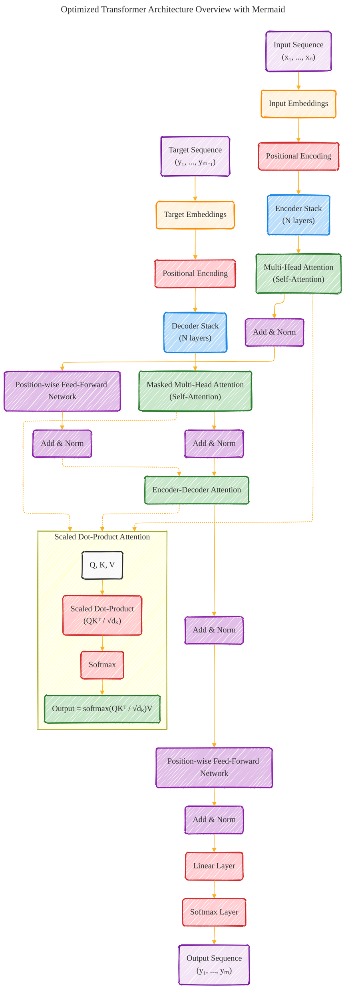

# Transformer Architecture Drafts
> **Disclaimer:**
>
> This document contains my personal notes on the topic,
> compiled from publicly available documentation and various cited sources.
> The materials are intended for educational purposes, personal study, and reference.
> The content is dual-licensed:
> 1. **MIT License:** Applies to all code implementations (Swift, Mermaid, and other programming languages).
> 2. **Creative Commons Attribution 4.0 International License (CC BY 4.0):** Applies to all non-code content, including text, explanations, diagrams, and illustrations.
---

## Optimized Transformer Architecture Overview with Mermaid

---

### Optimizations and Clarifications

1. **Class Definitions:** Utilized class definitions (`styleDef`, `classDef`) to apply consistent visual styles across similar components (e.g., all attention mechanisms share the same visual style). This enhances readability and visual hierarchy.

2. **Component Grouping:** Grouped related components into subgraphs where appropriate (e.g., the detailed view of Scaled Dot-Product Attention) to visually segregate distinct functional areas of the architecture.

3. **Directional Flow:** Employed directional arrows (`-->` for direct flow, `-.->` for conceptual or indirect connections) to delineate data flow versus conceptual relationships, such as the influence of the encoder's output on the encoder-decoder attention mechanism.

4. **Equation Representation:** Included key equations directly within node labels (e.g., "Scaled Dot-Product (QKᵀ / √dₖ)") to provide mathematical context inline with the architecture diagram.

5. **Enhanced Semantic Clarity:** Labels and node names explicitly describe each component's role within the architecture, e.g., "Masked Multi-Head Attention (Self-Attention)" clarifies the masking aspect relevant to decoder layers.

6. **Visual Cohesion:** Maintained a visually cohesive color scheme that aligns with the functional categorization of model components (attention mechanisms, embedding layers, etc.), facilitating quicker recognition and understanding of the architecture's key areas.

---
**Licenses:**

- **MIT License:**   - Full text in [LICENSE](LICENSE) file.
- **Creative Commons Attribution 4.0 International:**  - Legal details in [LICENSE-CC-BY](LICENSE-CC-BY) and at [Creative Commons official site](http://creativecommons.org/licenses/by/4.0/).

---