# Transformer Architecture Drafts
> **Disclaimer:**
>
> This document contains my personal notes on the topic,
> compiled from publicly available documentation and various cited sources.
> The materials are intended for educational purposes, personal study, and reference.
> The content is dual-licensed:
> 1. **MIT License:** Applies to all code implementations (Swift, Mermaid, and other programming languages).
> 2. **Creative Commons Attribution 4.0 International License (CC BY 4.0):** Applies to all non-code content, including text, explanations, diagrams, and illustrations.
---

## Transformer Architecture - A Draft Comprehensive Diagram

```mermaid
---
title: Optimized Transformer Architecture - Enhanced Clarity
config:
  layout: elk
  look: handDrawn
  theme: default
---
%%{
  init: {
    'fontFamily': 'verdana',
    'themeVariables': {
      'primaryColor': '#007acc',
      'primaryTextColor': '#fff',
      'primaryBorderColor': '#005a9e',
      'lineColor': '#f90',
      'secondaryColor': '#e8f3fb',
      'tertiaryColor': '#fff'
    }
  }
}%%
graph LR
    subgraph Transformer_Architecture["Transformer Architecture"]
    style Transformer_Architecture fill:#e8f3fb,stroke:#005a9e,stroke-width:2px

        A["Input Sequence<br>(x<sub>1</sub>, ..., x<sub>n</sub>)"] --> B["Input Embeddings<br>(Embedding(x<sub>i</sub>))"]
        B --> C["Positional Encoding<br>(PE)"]
        C --> D["Encoder Stack (N=6)"]

        %% subgraph Encoder_Layer["Encoder Layer (Repeated N Times)"]
        %% style Encoder_Layer fill:#d8e8ff,stroke:#005a9e,stroke-width:2px
        %%     E["Multi-Head Self-Attention (MSA)<br>Q,K,V ← Input"] --> F["Add & Norm"]
        %%     F --> G["Feed Forward<br>(FFN)"]
        %%     G --> H["Add & Norm"]
        %%     H -->|Output to Next Layer| Encoder_Layer
        %%     H -->|Output of Encoder| I["Decoder Input"]
        %%     E -- MSA Output --> F
        %%     G -- FFN Output --> H
        %% end

        D --> I["Decoder Stack (N=6)"]

        %% subgraph Decoder_Layer["Decoder Layer (Repeated N Times)"]
        %% style Decoder_Layer fill:#d8e8ff,stroke:#005a9e,stroke-width:2px
        %%     J["Masked MSA<br>(Q,K,V ← Output)"] --> K["Add & Norm"]
        %%     K --> L["Encoder-Decoder Attention<br>(Q ← Output, K,V ← Encoder Output)"]
        %%     L --> M["Add & Norm"]
        %%     M --> N["Feed Forward<br>(FFN)"]
        %%     N --> O["Add & Norm"]
        %%     J -- Masked MSA Output --> K
        %%     L -- Encoder-Decoder Output --> M
        %%     N -- FFN Output --> O
        %%     O -->|Output to Next Layer| Decoder_Layer
        %% end

        I --> P["Linear Layer"]
        P --> Q["Softmax"]
        Q --> R["Output Sequence<br>(y<sub>1</sub>, ..., y<sub>m</sub>)"]

        A --> S["Target Sequence<br>(y<sub>1</sub>, ..., y<sub>m-1</sub>)"]
        S --> T["Target Embeddings"]
        T --> U["Positional Encoding<br>(PE)"]
        U --> J

    end

    subgraph Attention_Mechanisms["Attention Mechanisms"]
    style Attention_Mechanisms fill:#c8e6c9,stroke:#43a047,stroke-width:2px
        V["Scaled Dot-Product Attention (SDPA)"] --> W["Attention(Q, K, V) = softmax(QK<sup>T</sup>/√d<sub>k</sub>)V"]
        E -- "Q, K, V" --> V
        L -- "Q, K, V" --> V
        J -- "Q, K, V" --> V

        W --> AA[Output]

        subgraph Multi_Head_Attention["Multi-Head Attention (MHA)"]
        style Multi_Head_Attention fill:#a7d9ae,stroke:#43a047,stroke-width:2px
            BB["MHA(Q, K, V) = Concat(head<sub>1</sub>, ..., head<sub>h</sub>)W<sup>O</sup>"] --> CC[Concat & Project]
            CC --> AA
            
            subgraph Head["head<sub>i</sub>"]
            style Head fill:#a7d9ae,stroke:#43a047,stroke-width:2px
                DD["head<sub>i</sub> = SDPA(QW<sub>i</sub><sup>Q</sup>, KW<sub>i</sub><sup>K</sup>, VW<sub>i</sub><sup>V</sup>)"] --> AA
            end
        end
    end

    style D fill:#f2f2f2,stroke:#005a9e,stroke-width:2px
    style I fill:#f2f2f2,stroke:#005a9e,stroke-width:2px
    style H fill:#f2f2f2,stroke:#005a9e,stroke-width:2px
    style O fill:#f2f2f2,stroke:#005a9e,stroke-width:2px
    style F fill:#f2f2f2,stroke:#005a9e,stroke-width:2px
    style M fill:#f2f2f2,stroke:#005a9e,stroke-width:2px
    
```

---

### Key Improvements and Explanations:

1.  **Simplified Layer Structure:** The Encoder and Decoder layers are now more concise. The "Add & Norm" steps and "Feed Forward" are clearly labeled, and the connections are simplified. The repeated nature of the Encoder and Decoder layers is now more visually obvious.
2.  **Data Flow:**  The arrows now indicate the flow of data more clearly.
3.  **Clearer Attention:** The `Scaled Dot-Product Attention` and `Multi-Head Attention` are now subgraphs.
4.  **Functionality:** The key equations are present, and the relationships between Q, K, and V (from the layers) and the attention mechanism are clearly demonstrated.
5.  **Masking:** The use of the mask in the Decoder's self-attention is explicitly noted as "Masked MSA."
6. **Conciseness:** All the steps in the model are present with less clutter.

This optimized diagram provides a more streamlined and easily understandable representation of the Transformer architecture, enhancing the clarity of the relationships between components.  It highlights the core operations and data flow with improved visual organization.

---
**Licenses:**

- **MIT License:**   - Full text in [LICENSE](LICENSE) file.
- **Creative Commons Attribution 4.0 International:**  - Legal details in [LICENSE-CC-BY](LICENSE-CC-BY) and at [Creative Commons official site](http://creativecommons.org/licenses/by/4.0/).

---