# Transformer Architecture Drafts
> **Disclaimer:**
>
> This document contains my personal notes on the topic,
> compiled from publicly available documentation and various cited sources.
> The materials are intended for educational purposes, personal study, and reference.
> The content is dual-licensed:
> 1. **MIT License:** Applies to all code implementations (Swift, Mermaid, and other programming languages).
> 2. **Creative Commons Attribution 4.0 International License (CC BY 4.0):** Applies to all non-code content, including text, explanations, diagrams, and illustrations.
---

## Transformer Architecture - A Draft Comprehensive Diagram

```mermaid
---
title: Transformer Architecture - Comprehensive Diagram
config:
  layout: elk
  look: handDrawn
  theme: default
---
graph TB
  %% Define Classes for styling
  classDef inputClass fill:#E3F2FD,stroke:#64B5F6
  classDef encoderClass fill:#E8F5E9,stroke:#81C784
  classDef decoderClass fill:#FFF3E0,stroke:#FFB74D
  classDef attentionClass fill:#FCE4EC,stroke:#F06292

  %% Input Embedding and Positional Encoding
  subgraph Input_and_Positional_Encoding["Input & Positional Encoding"]
    direction TB
    A["Input Sequence<br>(x₁, x₂, ..., xₙ)"]:::inputClass
    A --> B["Input Embedding<br>(Embedding(xₙ))"]:::inputClass
    B --> C["Positional Encoding<br>(PE<sub>pos</sub> = sinusoids)"]:::inputClass
    C --> D["Input to Encoder"]:::inputClass
  end

  %% Encoder Stack (N Layers)
  subgraph Encoder["Encoder Stack (N Layers)"]
    direction TB
    D --> E["Encoder Layer 1"]:::encoderClass
    E --> F["Encoder Layer 2"]:::encoderClass
    F --> G["..."]:::encoderClass
    G --> H["Encoder Layer N"]:::encoderClass
    H --> I["Encoder Output<br>(z₁, z₂, ..., zₙ)"]:::encoderClass
  end

  %% Detailed Encoder Layer
  subgraph Encoder_Layer_Detail["Encoder Layer Details"]
    direction TB
    %% Multi-Head Self-Attention
    subgraph MultiHead_Self_Attention
      direction TB
      J["Multi-Head Self-Attention<br>head_i = Attention(QW_i<sup>Q</sup>, KW_i<sup>K</sup>, VW_i<sup>V</sup>)"]:::attentionClass
      J --> K["Concatenate Heads<br>Concat(head₁, ..., head_h)W<sup>O</sup>"]:::attentionClass
    end
    K --> L["Add & Norm<br>LayerNorm(x + Sublayer(x))"]:::encoderClass
    L --> M["Feed-Forward Network<br>FFN(x) = max(0, xW₁ + b₁)W₂ + b₂"]:::encoderClass
    M --> N["Add & Norm<br>LayerNorm(x + Sublayer(x))"]:::encoderClass
  end

  E -- "Details" --- Encoder_Layer_Detail

  %% Decoder Input and Positional Encoding
  subgraph Decoder_Input["Decoder Input & Positional Encoding"]
    direction TB
    O["Shifted Target Sequence<br>(<start>, y₁, y₂, ..., yₘ₋₁)"]:::decoderClass
    O --> P["Target Embedding<br>(Embedding(yₖ))"]:::decoderClass
    P --> Q["Positional Encoding<br>(PE<sub>pos</sub> = sinusoids)"]:::decoderClass
    Q --> R["Input to Decoder"]:::decoderClass
  end

  %% Decoder Stack (N Layers)
  subgraph Decoder["Decoder Stack (N Layers)"]
    direction TB
    R --> S["Decoder Layer 1"]:::decoderClass
    S --> T["Decoder Layer 2"]:::decoderClass
    T --> U["..."]:::decoderClass
    U --> V["Decoder Layer N"]:::decoderClass
    V --> W["Decoder Output"]:::decoderClass
  end

  %% Detailed Decoder Layer
  subgraph Decoder_Layer_Detail["Decoder Layer Details"]
    direction TB
    %% Masked Multi-Head Self-Attention
    subgraph Masked_MultiHead_Self_Attention
      direction TB
      X["Masked Multi-Head Self-Attention"]:::attentionClass
      X --> Y["Concatenate Heads<br>Concat(head₁, ..., head_h)W<sup>O</sup>"]:::attentionClass
    end
    Y --> Z["Add & Norm<br>LayerNorm(x + Sublayer(x))"]:::decoderClass
    %% Encoder-Decoder Attention
    subgraph Encoder_Decoder_Attention
      direction TB
      AA["Multi-Head Attention over Encoder Output"]:::attentionClass
      AA --> AB["Concatenate Heads<br>Concat(head₁, ..., head_h)W<sup>O</sup>"]:::attentionClass
    end
    Z --> AB
    AB --> AC["Add & Norm<br>LayerNorm(x + Sublayer(x))"]:::decoderClass
    AC --> AD["Feed-Forward Network<br>FFN(x) = max(0, xW₁ + b₁)W₂ + b₂"]:::decoderClass
    AD --> AE["Add & Norm<br>LayerNorm(x + Sublayer(x))"]:::decoderClass
  end

  S -- "Details" --- Decoder_Layer_Detail

  %% Connections between Encoder Output and Decoder Layer
  I --> AA["Encoder Output (Keys and Values)"]:::encoderClass

  %% Output Projection and Softmax
  W --> AF["Linear Projection"]:::decoderClass
  AF --> AG["Softmax Layer<br>softmax(zᵢ) = e^(zᵢ) / Σ e^(zⱼ)"]:::decoderClass
  AG --> AH["Output Probabilities<br>(y₁, y₂, ..., yₘ)"]:::decoderClass

  %% Scaled Dot-Product Attention
  subgraph Attention["Scaled Dot-Product Attention"]
    direction TB
    AI["Queries (Q), Keys (K), Values (V)"]:::attentionClass
    AI --> AJ["Compute Attention Scores<br>(QK<sup>T</sup> / √dₖ)"]:::attentionClass
    AJ --> AK["Apply Softmax"]:::attentionClass
    AK --> AL["Compute Weighted Sum<br>Attention(Q, K, V) = softmax(...) V"]:::attentionClass
  end

  %% Connections for Attention
  J -- "Uses" --- Attention
  X -- "Uses" --- Attention
  AA -- "Uses" --- Attention

  %% Legend
  class A,B,C,D,O,P,Q,R inputClass
  class E,F,G,H,L,M,N encoderClass
  class S,T,U,V,Z,AC,AD,AE,W,AF,AG,AH decoderClass
  class J,K,X,Y,AA,AB,AI,AJ,AK,AL attentionClass

```

---

### Explanation of the Diagram

This diagram represents the full Transformer architecture, including all main components and their connections:

#### Input and Positional Encoding

- **Input Sequence (A):** The source tokens.
- **Input Embedding (B):** Each token is converted into an embedding vector.
- **Positional Encoding (C):** Positional information is added to the embeddings.
- **Input to Encoder (D):** The sum of embeddings and positional encodings is input to the encoder.

#### Encoder Stack

- **Encoder Layers (E-H):** The encoder consists of N identical layers.
- **Encoder Layer Details:** Each layer has:
  - **Multi-Head Self-Attention (J-K):** Allows the model to focus on different positions.
  - **Add & Norm (L):** Residual connection and layer normalization.
  - **Feed-Forward Network (M):** Position-wise fully connected feed-forward network.
  - **Add & Norm (N):** Another residual connection and layer normalization.

#### Decoder Input and Positional Encoding

- **Shifted Target Sequence (O):** The target tokens shifted right (for teacher forcing).
- **Target Embedding (P):** Each target token is converted into an embedding vector.
- **Positional Encoding (Q):** Positional information is added to the embeddings.
- **Input to Decoder (R):** The sum is input to the decoder.

#### Decoder Stack

- **Decoder Layers (S-V):** The decoder also consists of N identical layers.
- **Decoder Layer Details:** Each layer has:
  - **Masked Multi-Head Self-Attention (X-Y):** Prevents positions from attending to subsequent positions (masking future tokens).
  - **Add & Norm (Z):** Residual connection and layer normalization.
  - **Encoder-Decoder Attention (AA-AB):** Allows each position of the decoder to attend over all positions of the input sequence.
  - **Add & Norm (AC):** Residual connection and layer normalization.
  - **Feed-Forward Network (AD):** Position-wise feed-forward network.
  - **Add & Norm (AE):** Another residual connection and layer normalization.

#### Connections

- **Encoder Output to Encoder-Decoder Attention:** The output of the encoder is used as the Keys and Values in the Encoder-Decoder Attention layers of the decoder.
- **Attention Mechanism (Attention subgraph):** Used in all attention layers (Multi-Head Attention).
  - **Compute attention scores:** \( QK^T / \sqrt{d_k} \).
  - **Apply Softmax:** To obtain attention weights.
  - **Compute Weighted Sum:** Multiply the attention weights by the Values to get the output.

#### Output Projection and Softmax

- **Linear Projection (AF):** Maps decoder outputs to the vocabulary dimension.
- **Softmax Layer (AG):** Converts the outputs into probabilities over the vocabulary.
- **Output Probabilities (AH):** The predicted next token probabilities.

### Key Features

- **Proper Connections:** All components are properly connected to reflect the data flow through the model.
- **Mathematical Equations:** Key equations are included at relevant points in the diagram.
- **Color Coding:** Different classes are used to color-code different parts of the model for clarity. (Note: In text, color coding may not be visible.)
- **Attention Use Cases:** The same attention mechanism is used in different parts of the model (encoder self-attention, decoder self-attention, and encoder-decoder attention).

### Notes

- **Multi-Head Attention Equations:**
  - **Multi-Head Attention:** \( \text{MultiHead}(Q, K, V) = \text{Concat}(\text{head}_1, ..., \text{head}_h)W^O \)
  - **Attention Heads:** \( \text{head}_i = \text{Attention}(QW_i^Q, KW_i^K, VW_i^V) \)
  - **Scaled Dot-Product Attention:** \( \text{Attention}(Q, K, V) = \text{softmax}\left(\frac{QK^T}{\sqrt{d_k}}\right)V \)

- **Feed-Forward Network Equation:**
  - \( \text{FFN}(x) = \text{max}(0, xW_1 + b_1)W_2 + b_2 \)

- **Layer Normalization:**
  - \( \text{LayerNorm}(x + \text{Sublayer}(x)) \)

### Final Remarks

This diagram provides an optimized and detailed representation of the Transformer Architecture, ensuring that each component is properly connected. It includes the core mathematical equations embedded within the diagram at relevant points, aiding in understanding both the structural and mathematical aspects of the model.

By visually mapping out the flow of data and the operations performed at each step, this diagram serves as a comprehensive guide to the Transformer model as described in the "Attention Is All You Need" paper.

---
**Licenses:**

- **MIT License:**   - Full text in [LICENSE](LICENSE) file.
- **Creative Commons Attribution 4.0 International:**  - Legal details in [LICENSE-CC-BY](LICENSE-CC-BY) and at [Creative Commons official site](http://creativecommons.org/licenses/by/4.0/).

---