# Transformer Architecture Drafts
> **Disclaimer:**
>
> This document contains my personal notes on the topic,
> compiled from publicly available documentation and various cited sources.
> The materials are intended for educational purposes, personal study, and reference.
> The content is dual-licensed:
> 1. **MIT License:** Applies to all code implementations (Swift, Mermaid, and other programming languages).
> 2. **Creative Commons Attribution 4.0 International License (CC BY 4.0):** Applies to all non-code content, including text, explanations, diagrams, and illustrations.
---

## Transformer Architecture - A Draft Comprehensive Diagram

```mermaid
---
title: Optimized Transformer Architecture
config:
  layout: elk
  look: handDrawn
  theme: dark
---
%%{
  init: {
    'fontFamily': 'verdana',
    'themeVariables': {
      'primaryColor': '#BB2528',
      'primaryTextColor': '#f529',
      'primaryBorderColor': '#7C0000',
      'lineColor': '#F8B229',
      'secondaryColor': '#006100',
      'tertiaryColor': '#fff'
    }
  }
}%%
flowchart LR
    %% ------------------ ENCODER ------------------ %%
    subgraph Encoder["Encoder (N Layers)"]
    direction TB
    A1["(Input Sequence<br>(x₁,...,xₙ))"] --> A2{"{Input Embeddings<br>Embedding(xᵢ)}"}
    A2 --> A3["Positional Encoding<br>PE(pos,2i)=sin(pos/10000^(2i/d<sub>model</sub>)),<br>PE(pos,2i+1)=cos(pos/10000^(2i/d<sub>model</sub>))"]
    A3 --> A4["Encoder Layer 1"]
    
    subgraph Encoder_Layer_i["Encoder Layer i"]
    direction TB
        A5["Multi-Head Self-Attention<br>head<sub>i</sub>=Attention(QW<sub>i</sub>^Q, KW<sub>i</sub>^K, VW<sub>i</sub>^V),<br>Concat(head₁...headₕ)W<sup>O</sup>"] --> A6["Add & Norm<br>x + Sublayer(x) → LayerNorm(...)"]
        A6 --> A7["Position-wise FFN<br>FFN(x)=max(0,xW₁+b₁)W₂+b₂"]
        A7 --> A8["Add & Norm<br>x + Sublayer(x) → LayerNorm(...)"]
    end
    A4 --> A5
    A8 --> A9[(Output to Next Encoder Layer)]
    
    A9 -.-> A10["Encoder Layer 2"]
    A10 -.-> A11["Encoder Layer 3"]
    A11 -.-> A12["... Up to Layer N ..."]
    end

    %% Output of the encoder (z₁...zₙ) to be used in the decoder
    A12 --> A13["(Encoder Output<br>(z₁,...,zₙ))"]

    %% ------------------ DECODER ------------------ %%
    subgraph Decoder["Decoder (N Layers)"]
    direction TB
    B1["(Target Sequence<br>(y₁,...,yₘ₋₁))"] --> B2{"{Target Embeddings<br>Embedding(yᵢ)}"}
    B2 --> B3[Positional Encoding<br>Same sinusoidal scheme]
    B3 --> B4["Decoder Layer 1"]
    
    subgraph Decoder_Layer_i["Decoder Layer i"]
    direction TB
        B5["Masked Multi-Head Self-Attention<br>(Future tokens masked)"] --> B6["Add & Norm"]
        B6 --> B7["Encoder-Decoder Attention<br>(Queries from decoder,<br>Keys/Values from encoder)"]
        B7 --> B8["Add & Norm"]
        B8 --> B9["Position-wise FFN<br>(Same FFN formula)"]
        B9 --> B10["Add & Norm"]
    end
    B4 --> B5
    B10 --> B11[(Output to Next Decoder Layer)]
    
    B11 -.-> B12["Decoder Layer 2"]
    B12 -.-> B13["Decoder Layer 3"]
    B13 -.-> B14["... Up to Layer N ..."]
    end

    B14 --> B15["(Decoder Output<br>(d<sub>model</sub>-dimensional))"]

    %% ------------------ OUTPUT PROJECTION (LINEAR + SOFTMAX) ------------------ %%
    B15 --> C1["Linear Projection<br>(d<sub>model</sub>→Vocabulary Size)"]
    C1 --> C2["Softmax<br>softmax(zᵢ) = exp(zᵢ)/Σ<sub>j</sub>exp(zⱼ)"]
    C2 --> C3["(Predicted Token Probabilities<br>(yₘ))"]

    %% -------------- SCALED DOT PRODUCT ATTENTION REFERENCE -------------- %%
    subgraph ScaledDotProduct["Scaled Dot-Product Attention"]
    direction TB
    S1["Attention(Q,K,V)=softmax((QK^T)/√(d<sub>k</sub>))·V"]
    end

    %% ------------------ ARROWS / DATA FLOW ------------------ %%
    A13 -->|Used as K,V in enc-dec attention| B7
    B15 -->|Iteratively generates final tokens| C1
    S1 -.-> A5
    S1 -.-> B5
    S1 -.-> B7

```

----

### Explanation of Key Components

• Encoder (left side):  
  – Embeddings and Positional Encoding are added to convert raw tokens into dₘₒdₑₗ-dimensional vectors that incorporate word meaning and position.  
  – Each encoder layer has Multi-Head Self-Attention (to capture relationships between all tokens in the input sequence) and a Position-wise Feed-Forward Network, each followed by residual connections and layer normalization.

• Decoder (right side):  
  – Also uses embeddings and positional encoding for the partial target sequence.  
  – Each decoder layer has:  
    1) Masked Multi-Head Self-Attention (to avoid attending to future tokens),  
    2) Encoder-Decoder Attention (queries come from the decoder, keys/values come from the encoder),  
    3) Position-wise FFN, with similar residual + normalization structure.

• Scaled Dot-Product Attention (center subgraph):  
  – The core equation: Attention(Q,K,V) = softmax((QKᵀ) / √dₖ) · V.  
  – Multi-Head Attention in the encoder/decoder repeats this attention mechanism across h heads in parallel.

• Final Projection and Softmax:  
  – The decoder’s last output is projected to the vocabulary dimension via a linear layer, then normalized with a softmax to yield probabilities of the next token.

This optimized diagram captures each core component of the Transformer, including how inputs flow through the encoder and decoder, how the encoder output connects to the decoder’s attention, and how token probabilities are produced.

---
**Licenses:**

- **MIT License:**   - Full text in [LICENSE](LICENSE) file.
- **Creative Commons Attribution 4.0 International:**  - Legal details in [LICENSE-CC-BY](LICENSE-CC-BY) and at [Creative Commons official site](http://creativecommons.org/licenses/by/4.0/).

---