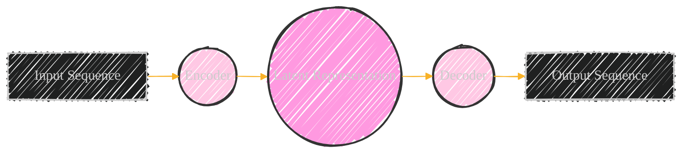
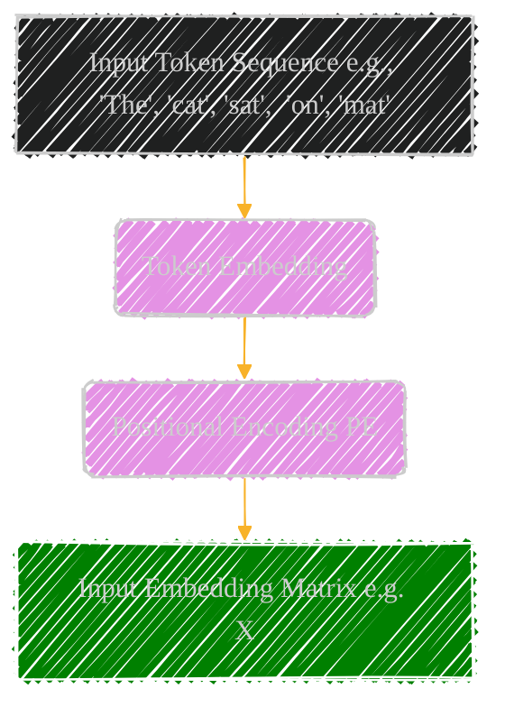
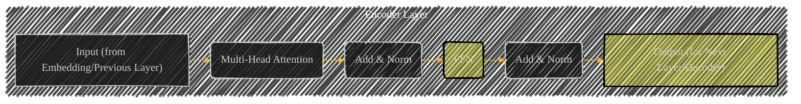
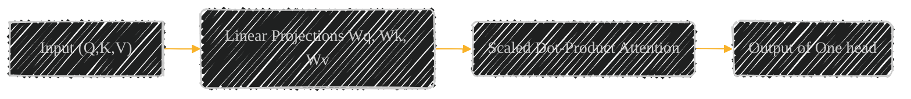
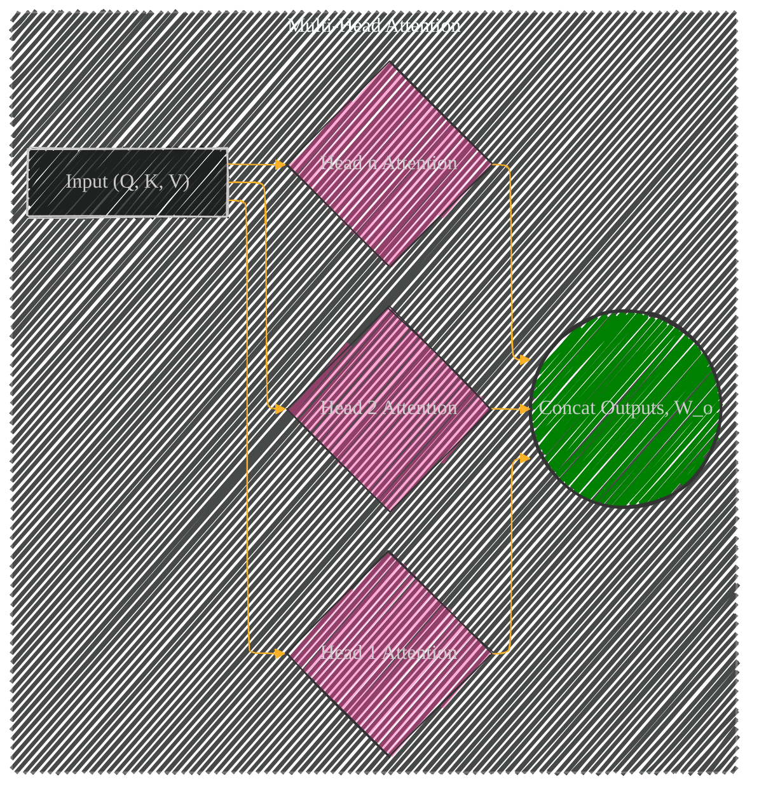
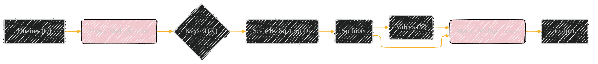
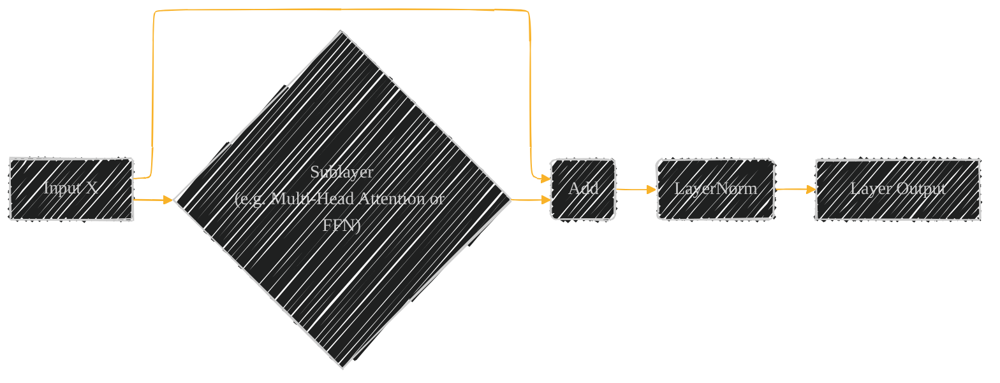
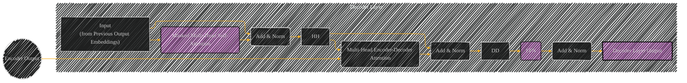

# Transformer - The Orignal Model
> This content is dual-licensed under your choice of the following licenses:
> 1.  **MIT License:** For the code implementations in Swift and Mermaid provided in this document.
> 2.  **Creative Commons Attribution 4.0 International License (CC BY 4.0):** For all other content, including the text, explanations, and the Mermaid diagrams and illustrations.

---

Below is my personal notes on the topics and I might gather information from various sources, which I wil cite accordingly.

---

## Transformer Model Illustrated: A Component-by-Component & Interactive Guide in Mermaid and LaTeX

### 1. Overall Architecture: Encoder-Decoder Structure.

**LaTeX Explanation**: The foundation of the Transformer is the encoder-decoder architecture. The *Encoder* processes the input sequence, creating a *Latent Representation* (contextual understanding), which then serves as input to the *Decoder* to produce the *Output Sequence*. This architecture enables sequence-to-sequence transformations, exemplified mathematically in the attention mechanism $Attention(Q, K, V)$.

---

### 2. Input Embedding and Positional Encoding: Preparing Raw Input Data.

**Diagram 1: Components of the input process**

**LaTeX Explanation**: Initially, Each word/token $x_i$ from an initial sequence X is transformed into a low-dimensional vector space by means of an learned embedding matrix $A$. This can by described as:

$$X =  E_0(x_i), i=1,2,...,N$$

Where $E_0$ denotes the first mapping layer. However, because the transformer is not made known to that an incoming word has a specific positional place in a sequence $X = \{x_1, x_2, ..., x_N\}$:

$$X_{pos}  = X + PE$$

Then these inputs are fed forward to:

1.  Embedding Matrix $E_0$: Maps a sequence ($\{x_1 , x_2, ..., x_N \}$ ) elements into $X_0$ representing the initial input by mapping each word/token to an embedding vector.
2.  Positional Encoding (PE): a matrix summarizing the position of each element in the sequence.

---

### 3. Encoder Layer: The Building Block.

**LaTeX Explanation**: Each Encoder Layer is composed of Multi-Head Attention. Following Self-attention, a Residual Connections and Layer Normalization are applied. Finally, a Feed-Forward Network (FFN) further processes outputs produced with two residual connectins .

**Multi-Head Attention :** Key building block with: $$MultiHead(Q, K, V)) = Concat(head_{1}, ..., Head_h)W_0$$, where $$head_i = Attention(QW_1, KW_2, VW_3)$$
Each $Q, K, V \in \mathbb{R}^{d_{model}}$ get their projection matrix $W_1 \in R_{\text{model} \cdot d_k}$; $W_2 \in R_{\text{model} \cdot d_k}$; And $W_2, V \in R_{\text{model} \times d_v }$

The feed-forward network includes $$FFNN(x) = max(0, xW_1 +b_1)W_2 + b_2$$ Where $x$ comes from Attention or Residual Output, $W$,b are learnable parameters between the two Linear Transform functions, the the ReLU activation layers as follows which are connected.

First component, `(x + SubLayer(x)`) a *residual Connection* by adding input `x` directly to its output, where attention, FNN are regarded as `SubLayer(*)` in residual output, helping gradients flow. After `Add`, you apply the Layer Normalization.

---

### 4. Multi-Head Attention: The Core Mechanism.

**Diagram 1:** Detail of a single attention head.

**Diagram 2:**  Combining Multiple Heads.

**LaTeX Explanation**:The Multi-Head Attention is the core mechanism.  Input vectors `(Q, K, V)` undergo learned linear projections for queries, keys and values. Each attention mechanism (head) is characterized as follows:

$$
Attention(Q, K, V) = softmax\left(\frac{{QK}^\top}{{\sqrt{d_k}}}\right)V
$$

where the dot product captures the the similarity bewteen $q$'s and $K$
Then this mechanism computes the *scaled dot-product attention*. Following these projections these outputs can be processed. This procedure is applied  parallel using `h` independent attention heads. Finally these results are concatenated and projected for the Multihead component shown in last phase.
This process is replicated and outputs combined at final output via learned matrix which you can see at the Diagram 2.

----

### 5. Scaled Dot-Product Attention: Breaking the Dot Product Down for one head

**LaTeX Explanation:** Dot-product scaled mechanism works on these principles via following three parts:

    1. First scale $QK^\top/\sqrt{{{d}_{k}}}$. This is the matrix multiplication of ${Q}$ and the transpose of ${K}$ . Then you should scaling that part as $\sqrt{{\frac{1}{{{d}_{k}}}}}$, Where: $dk$ represents the feature dimension for ${\textit{Q}}$ and $K$ . Helps to counter out the big gradients that results during training. We generally want a more stable training environment without high variations.
    2.  Then 
        $$softmax(\sqrt{QT/(\sqrt{dk})})$$
    which converts into attention weights that corresponds to a probability between the each of the $Q$, $K$, $V$ input components.
    3. Finally the values, Multiply the the scaling part we made earlier, with $V$ inputs  we now take the weighted sum of the $V$ inputs
        Where $Q$, $K$, $V$ stand for the input matrices, $d_k$ is the keys dimensionality. softmax calculates the normalized probabilities that indicate from each input source and the amount of its contribution.

----

### 6. Residual Connections, and Layer normalization.

**Diagram:** Combining layers and components in order to work as building blocks of the overall components in Transformer model

**LaTeX Explanation**: Add and layer normalization for our model work follows mathematical principles mentioned as residual operations that help gradients flow ($X + f\left(X\right)$)
    where $X$ represents as to our Layer's input. the key role is to prevent gradient vanishing problems and this components help train easier and converge faster.
    We want to regularize the neural network using mean and variances in Layer Normalization as follows.
	$$\hat{x}_i=\frac{x_i-\mu_i}{\sqrt{\sigma_i^2+\varepsilon}}$$

    where;
    \*xi: denotes input with ith sample in our dimension/layer

    \*   $mu$:  the  sample input with mean for layer's batch
    \*  $\sigma_i$ : the sample inputs' standard's deviation layer  for batch&#x20;
    \*  $\varepsilon$ : a small constant to assure a division stability factor.

Then applying:
    $$y= a*\hat{x} + b$$

With a scale parameter named $a$, where $a$, b are learnable variables. These also help in stabilizating gradients of the training environment, leading us to use the architecture more practically for complex task. These ensures the model learns how to converge as it does a better optimization.

---

### 7. Decoder Layer: Distinctive Architecture

**LaTeX Explanation**:The decoder leverages the encoder output.
    *   \*\*Masked Multi-Head Self-Attention:\*\* The Decoder layer processes input in self attention to a Mask will the apply previous tokens like the one done in Encoder layer process but not use future words from the final step
    *   \*\*Encoder-Decoder Attention:\*\* where  the key difference lies at where this component attends to the encoder's output such as *queries*, coming this time form self-attention mechanism in the previus layer of decoder, where this components attends to the input that encoder layer had given before to fully construct the outputs by combining that, in its outputs is a good construction for any final token result. $Q$, $K$, $V$ are output from multi-head and also the keys are also the encoder
    *   FFN /Add and Norm This, after all process we have our final Feed-forward Networks with Additions and Layers Normalized as they were done in Encoder Layer. The key to this process, is at each iteration. Therefore:

    $$Attention(Q,K,V) = softmax(\frac{QK^T}{(d_K)^.5})V$$

---

### 8. Output Generation: The Final step that builds probabilities.
Here diagram showing what comes out to make sense for our end goals on prediction side.

**LaTeX explanation**:
This the crucial step following the stack layers in Decoder for generation.

You'll need the following component to wrap the operations to make this steps in following manner.

**Linear**: the mapping transform, or the final projection.

**Lineal Tranformation**:

$$\text{P}(z_i | w_1, . . . ,  w_{N-i}) = Softmax[o[0]]$$
$$(where {O[N-1] = \hat{O}_i)} \in { R^{ d_{model} x D}}$$

For output with probabilities for vocabulary the inputs will pass via  $o$  projection, and these outputs ($o$ as a feature, or, by matrix' multiplication, $oW$) is needed from the softmax.

W represents the learned weights, where for probabilities our next action, we will: $$Softmax(x_iW_{final} + b_{final})$$

The outcome, the result, from this function is a vocabulary.

**Softmax**: We already seen it, that is $soft:R^n \rightarrow    R_i$.

Select and choose a next tokens probability $max[i]$ which gives out $${\hat{y} } = argmax { P(i)}$$, then make the final output.

You can add many types of modifications from our previous findings such as how the Core-ML helps etc... to the previous steps.

---
**Licenses:**

- **MIT License:**   - Full text in [LICENSE](LICENSE) file.
- **Creative Commons Attribution 4.0 International:**  - Legal details in [LICENSE-CC-BY](LICENSE-CC-BY) and at [Creative Commons official site](http://creativecommons.org/licenses/by/4.0/).

---