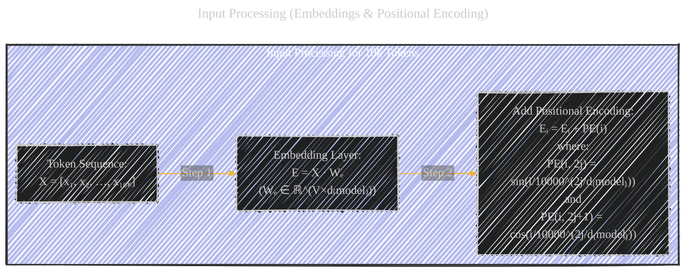
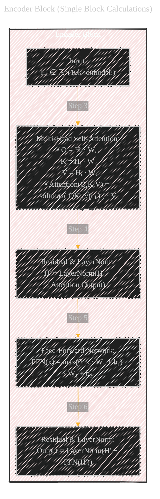
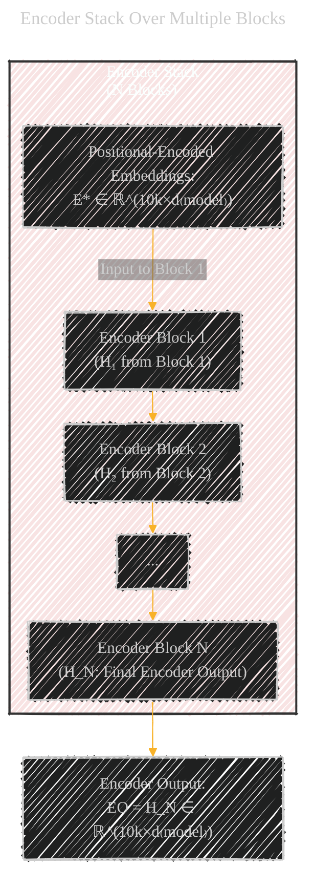
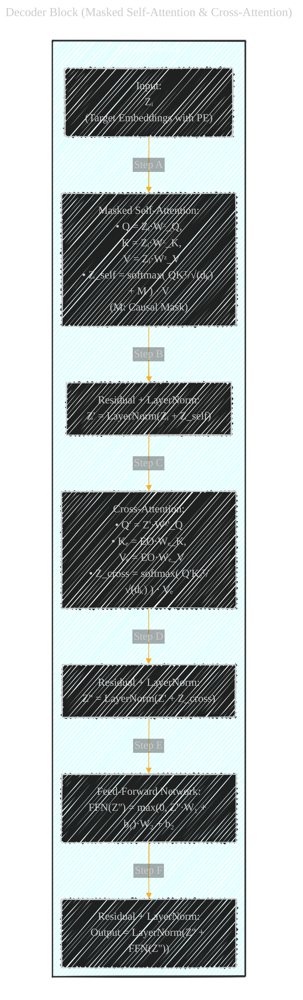

# Transformer Calculation Flow
> **Disclaimer:**
>
> This document contains my personal notes on the topic,
> compiled from publicly available documentation and various cited sources.
> The materials are intended for educational purposes, personal study, and reference.
> The content is dual-licensed:
> 1. **MIT License:** Applies to all code implementations (Swift, Mermaid, and other programming languages).
> 2. **Creative Commons Attribution 4.0 International License (CC BY 4.0):** Applies to all non-code content, including text, explanations, diagrams, and illustrations.
---

## A Diagrammatic Guide with Equations

Below are a collection of Mermaid diagrams that incorporate key math equations at each step and block. These illustrations trace the calculation process inside the Transformer—from the processing of inputs to the generation of final outputs.

────────────────────────────

### Diagram 1. Input Processing (Embeddings & Positional Encoding)

────────────────────────────

---

────────────────────────────

### Diagram 2. Encoder Block (Single Block Calculations)

────────────────────────────

DOI: [10.13140/RG.2.2.24095.68002](http://dx.doi.org/10.13140/RG.2.2.24095.68002)

---

────────────────────────────

### Diagram 3. Encoder Stack Over Multiple Blocks

────────────────────────────

DOI: [10.13140/RG.2.2.10673.90721](http://dx.doi.org/10.13140/RG.2.2.10673.90721)

---

────────────────────────────

### Diagram 4. Decoder Block (Masked Self-Attention & Cross-Attention)

────────────────────────────

DOI: [10.13140/RG.2.2.29548.27522](http://dx.doi.org/10.13140/RG.2.2.29548.27522)

---

────────────────────────────

### Diagram 5. Decoder Stack & Final Output Projection

────────────────────────────

DOI: [10.13140/RG.2.2.19481.94569](http://dx.doi.org/10.13140/RG.2.2.19481.94569)

---

────────────────────────────

### Diagram 6. Full Transformer Architecture Flow Overview

────────────────────────────

DOI: [10.13140/RG.2.2.26192.83203](http://dx.doi.org/10.13140/RG.2.2.26192.83203)

----

These diagrams, with embedded equations, illustrate the following:

• The input tokens X are converted into embeddings using a weight matrix Wₑ and then enhanced with positional encodings PE.  
• In each encoder block, the self‑attention mechanism computes queries, keys, and values (using learned matrices Wᵩ, Wₖ, and Wᵥ) and applies the scaled dot-product attention formula. A residual connection and layer normalization follow; then, an FFN is applied with its own residual connection and normalization.  
• The encoder stack applies these blocks sequentially to produce an encoder output EO.  
• In the decoder block, target embeddings (with PE) first undergo masked self‑attention (ensuring autoregressive behavior) and then attend to the encoder outputs via cross‑attention. Residual connections and layer normals accompany each sub-layer, and an FFN is again applied.  
• Finally, the decoder’s output is projected via a linear layer followed by a softmax to yield the final probability distribution ŷ over the vocabulary.

Together, these diagrams with math equations provide a step-by-step reference to the calculations that occur in a standard Transformer architecture.

---
**Licenses:**

- **MIT License:**   - Full text in [LICENSE](LICENSE) file.
- **Creative Commons Attribution 4.0 International:**  - Legal details in [LICENSE-CC-BY](LICENSE-CC-BY) and at [Creative Commons official site](http://creativecommons.org/licenses/by/4.0/).

---