# Transformer Architecture Drafts
> **Disclaimer:**
>
> This document contains my personal notes on the topic,
> compiled from publicly available documentation and various cited sources.
> The materials are intended for educational purposes, personal study, and reference.
> The content is dual-licensed:
> 1. **MIT License:** Applies to all code implementations (Swift, Mermaid, and other programming languages).
> 2. **Creative Commons Attribution 4.0 International License (CC BY 4.0):** Applies to all non-code content, including text, explanations, diagrams, and illustrations.
---

## Transformer Architecture - A Draft Comprehensive Diagram

```mermaid
---
title: Optimized Transformer Architecture
config:
  layout: elk
  look: handDrawn
  theme: default
---
%%{
  init: {
    'fontFamily': 'verdana',
    'themeVariables': {
      'primaryColor': '#BB2528',
      'primaryTextColor': '#f529',
      'primaryBorderColor': '#7C0000',
      'lineColor': '#F8B229',
      'secondaryColor': '#006100',
      'tertiaryColor': '#fff'
    }
  }
}%%
graph TD
    %% Top-level: Transformer Architecture
    subgraph Transformer["Transformer Architecture"]
    style Transformer fill:#EAF7FF,stroke:#3A89BF,stroke-width:2px

        A["Input Sequence<br>(x₁, x₂, ..., xₙ)"] -->|Tokenized| B["Input Embeddings<br>Embedding(x₁, x₂, ..., xₙ)"]
        B -->|Add| C["Positional Encodings<br>(sin/cos functions)"]
        C --> D["Encoder Stack (N Layers)"]
        
        %% Encoder Stack Subgraph
        subgraph Encoder["Encoder Stack (N Layers)"]
        style Encoder fill:#FFF9C4,stroke:#FFA726,stroke-width:2px

            subgraph Encoder_Layer["Encoder Layer"]
            style Encoder_Layer fill:#FBE9E7,stroke:#FF7043,stroke-width:1.5px

                E["Multi-Head Self-Attention<br>Attention(Q, K, V) = softmax(QKᵀ/√dₖ)V"] 
                E --> F["Add & Norm<br>LayerNorm(x + Sublayer(x))"]
                F --> G["Position-wise Feed-Forward Network<br>FFN(x) = max(0, xW₁ + b₁)W₂ + b₂"]
                G --> H["Add & Norm<br>LayerNorm(x + Sublayer(x))"]

            end

            D -->|Repeated N Times| E
            H --> I["Encoder Output<br>(z₁, z₂, ..., zₙ)"]
        end

        I --> J["Decoder Stack (N Layers)"]

        %% Decoder Stack Subgraph
        subgraph Decoder["Decoder Stack (N Layers)"]
        style Decoder fill:#E8F5E9,stroke:#43A047,stroke-width:2px

            subgraph Decoder_Layer["Decoder Layer"]
            style Decoder_Layer fill:#DCEDC8,stroke:#689F38,stroke-width:1.5px

                K["Masked Multi-Head Self-Attention<br>(Prevent Future Token Attention)"] 
                K --> L["Add & Norm<br>LayerNorm(x + Sublayer(x))"]

                L --> M["Encoder-Decoder Attention<br>Attention(Q_decoder, K_encoder, V_encoder)"]
                M --> N["Add & Norm<br>LayerNorm(x + Sublayer(x))"]

                N --> O["Position-wise Feed-Forward Network<br>FFN(x) = max(0, xW₁ + b₁)W₂ + b₂"]
                O --> P["Add & Norm<br>LayerNorm(x + Sublayer(x))"]

            end

            J -->|Repeated N Times| K
            P --> Q["Decoder Output<br>(y₁, y₂, ..., yₘ)"]
        end

        Q --> R["Linear Layer"]
        R --> S["Softmax Layer<br>softmax(zᵢ) = e^(zᵢ)/Σⱼe^(zⱼ)"]
        S --> T["Output Sequence<br>(Predicted Tokens)"]

        %% Target Embeddings for Decoder Input
        A_target["Target Sequence<br>(y₁, y₂, ..., yₘ₋₁)"] --> U["Target Embeddings<br>Embedding(y₁, y₂, ..., yₘ₋₁)"]
        U -->|Add| V["Positional Encodings"]
        V --> K
        
    end

    %% Subgraph for Scaled Dot-Product Attention
    subgraph Attention_Mechanism["Attention Mechanism (Core Component)"]
    style Attention_Mechanism fill:#FFEBEE,stroke:#D32F2F,stroke-width:2px

        X["Input: Queries (Q), Keys (K), Values (V)"] --> Y["Scaled Dot-Product Attention<br>softmax(QKᵀ/√dₖ)V"]

        Y --> Z1["Self-Attention (Encoder)<br>(Q = K = V from Encoder Output)"]
        Y --> Z2["Masked Self-Attention (Decoder)<br>(Future Mask Applied on K & V)"]
        Y --> Z3["Encoder-Decoder Attention<br>(Q from Decoder, K & V from Encoder Output)"]

    end

    %% Connections between Core Components
    E -- Q=K=V from Encoder Embeddings --> Z1
    K -- Masked Attention on Decoder Embeddings --> Z2
    M -- Q from Decoder Output; K,V from Encoder Output --> Z3
    
```

---

### Explanation of the Optimized Diagram

This optimized Mermaid diagram ensures all components of the Transformer architecture are properly interconnected. Each part is represented as a subgraph with clearly defined responsibilities and flow of data.

---

#### **Top-Level Components**
1. **Input Sequence and Embeddings:**
   - The input sequence `(x₁, x₂, ..., xₙ)` is first converted into embeddings using the learned embedding layer.
   - Positional encodings (`sin/cos` functions) are added to provide positional context to the embeddings.

2. **Encoder Stack (N Layers):**
   - Each encoder layer contains:
     - **Multi-Head Self-Attention:** Computes attention scores using scaled dot-product attention.
     - **Add & Norm:** Adds residual connections followed by layer normalization.
     - **Feed-Forward Network (FFN):** Applies position-wise transformations with a ReLU activation.
   - The encoder stack outputs `(z₁, z₂, ..., zₙ)` to be consumed by the decoder.

3. **Decoder Stack (N Layers):**
   - Each decoder layer contains:
     - **Masked Multi-Head Self-Attention:** Prevents attending to future tokens.
     - **Encoder-Decoder Attention:** Focuses on relevant encoder outputs using attention.
     - **Feed-Forward Network (FFN):** Similar to the encoder.
   - Outputs `(y₁, y₂, ..., yₘ)`.

4. **Output Sequence:**
   - The decoder's output is passed through a linear layer and softmax function to generate probabilities over the vocabulary for each token position.

5. **Target Embeddings for Decoder Input:**
   - The target sequence `(y₁, ..., yₘ₋₁)` from training data is embedded and fed into the decoder as input during training.

---

#### **Attention Mechanism Subgraph**
The attention mechanism is the core of the Transformer model:
1. **Scaled Dot-Product Attention:**
   - Formula: `softmax(QKᵀ / √dₖ)V`
   - Handles three types of attention:
     - **Self-Attention (Encoder):** Query (`Q`), Key (`K`), and Value (`V`) are derived from the encoder's input embeddings.
     - **Masked Self-Attention (Decoder):** Similar to self-attention but applies masking to prevent peeking at future tokens.
     - **Encoder-Decoder Attention:** Combines `Q` from the decoder with `K` and `V` from the encoder's output.

---

#### **Optimized Features**
1. **Hierarchical Design:** The model is split into logical subgraphs (e.g., Encoder Stack, Decoder Stack, Attention Mechanism), making it modular and easy to interpret.
2. **Clear Data Flow:** Arrows show the flow of data and how each component interacts with others.
3. **Mathematical Equations:** Key equations like scaled dot-product attention and softmax are included within relevant nodes.
4. **Color-Coded Subgraphs:** Each subgraph has distinct colors to differentiate between encoder, decoder, and attention mechanisms.

---
**Licenses:**

- **MIT License:**   - Full text in [LICENSE](LICENSE) file.
- **Creative Commons Attribution 4.0 International:**  - Legal details in [LICENSE-CC-BY](LICENSE-CC-BY) and at [Creative Commons official site](http://creativecommons.org/licenses/by/4.0/).

---