# Transformer Architecture Drafts
> **Disclaimer:**
>
> This document contains my personal notes on the topic,
> compiled from publicly available documentation and various cited sources.
> The materials are intended for educational purposes, personal study, and reference.
> The content is dual-licensed:
> 1. **MIT License:** Applies to all code implementations (Swift, Mermaid, and other programming languages).
> 2. **Creative Commons Attribution 4.0 International License (CC BY 4.0):** Applies to all non-code content, including text, explanations, diagrams, and illustrations.
---

## Transformer Architecture - A Draft Comprehensive Diagram

```mermaid
---
title: Optimized Transformer Architecture
config:
  layout: elk
  look: handDrawn
  theme: default
---
%%{
  init: {
    'fontFamily': 'verdana',
    'themeVariables': {
      'primaryColor': '#007acc',
      'primaryTextColor': '#fff',
      'primaryBorderColor': '#005a9e',
      'lineColor': '#f90',
      'secondaryColor': '#e8f3fb',
      'tertiaryColor': '#fff'
    }
  }
}%%
graph LR
    subgraph Transformer_Architecture["Transformer Architecture"]
    style Transformer_Architecture fill:#e8f3fb,stroke:#005a9e,stroke-width:2px

        A["Input Sequence<br>(x<sub>1</sub>, ..., x<sub>n</sub>)"] --> B["Input Embeddings<br>(Embedding(x<sub>i</sub>))"]
        B --> C["Positional Encoding<br>(PE<sub>pos,2i</sub> = sin(pos/10000<sup>2i/d<sub>model</sub></sup>)<br>PE<sub>pos,2i+1</sub> = cos(pos/10000<sup>2i/d<sub>model</sub></sup>)"]
        C --> D["Encoder Stack<br>(N layers)"]

        subgraph Encoder_Layer["Encoder Layer (N Times)"]
        style Encoder_Layer fill:#d8e8ff,stroke:#005a9e,stroke-width:2px
            E["Multi-Head Self-Attention<br>(MultiHead(Q, K, V) = Concat(head<sub>1</sub>, ..., head<sub>h</sub>)W<sup>O</sup><br>head<sub>i</sub> = Attention(QW<sub>i</sub><sup>Q</sup>, KW<sub>i</sub><sup>K</sup>, VW<sub>i</sub><sup>V</sup>))"] --> F["Add & Norm<br>(LayerNorm(x + Sublayer(x)))"]
            F --> G["Position-wise Feed-Forward Network<br>(FFN(x) = max(0, xW<sub>1</sub> + b<sub>1</sub>)W<sub>2</sub> + b<sub>2</sub>)"]
            G --> H["Add & Norm<br>(LayerNorm(x + Sublayer(x)))"]
            
            H -->|Output to Next Layer| D
        end

        D --> I["Decoder Stack<br>(N layers)"]

        subgraph Decoder_Layer["Decoder Layer (N Times)"]
        style Decoder_Layer fill:#d8e8ff,stroke:#005a9e,stroke-width:2px
            J["Masked Multi-Head Self-Attention<br>(MultiHead(Q, K, V))"] --> K["Add & Norm<br>(LayerNorm(x + Sublayer(x)))"]
            K --> L["Encoder-Decoder Attention<br>(MultiHead(Q, K, V))"]
            L --> M["Add & Norm<br>(LayerNorm(x + Sublayer(x)))"]
            M --> N["Position-wise Feed-Forward Network<br>(FFN(x) = max(0, xW<sub>1</sub> + b<sub>1</sub>)W<sub>2</sub> + b<sub>2</sub>)"]
            N --> O["Add & Norm<br>(LayerNorm(x + Sublayer(x)))"]
            
            O -->|Output to Next Layer| I
        end
        
        I --> P["Linear Layer"]
        P --> Q["Softmax Layer<br>(softmax(z<sub>i</sub>) = e<sup>z<sub>i</sub></sup>/Σ<sub>j</sub>e<sup>z<sub>j</sub></sup>)"]
        Q --> R["Output Sequence<br>(y<sub>1</sub>, ..., y<sub>m</sub>)"]

        A --> S["Target Sequence<br>(y<sub>1</sub>, ..., y<sub>m-1</sub>)"]
        S --> T["Target Embeddings<br>(Embedding(y<sub>i</sub>))"]
        T --> U["Positional Encoding<br>(PE<sub>pos,2i</sub>, PE<sub>pos,2i+1</sub>)"]
        U --> J
    end

    subgraph Scaled_Dot_Product_Attention["Scaled Dot-Product Attention"]
    style Scaled_Dot_Product_Attention fill:#c8e6c9,stroke:#43a047,stroke-width:2px
        V["Input (Q, K, V)"] --> W["Scaled Dot-Product Attention<br>(QK<sup>T</sup>/√d<sub>k</sub>)"]
        W --> X["Softmax Layer<br>(softmax(QK<sup>T</sup>/√d<sub>k</sub>))"]
        X --> Y["Output<br>(Attention(Q, K, V) = softmax(QK<sup>T</sup>/√d<sub>k</sub>)V)"]
        V --> Y
    end
        
    E -- "Q, K, V" --> V
    J -- "Q, K, V" --> V
    L -- "Q from Decoder, K, V from Encoder" --> V

```

---

### Explanation and Optimizations

1. **Overall Structure:** The optimized diagram is structured to clearly separate the main components of the Transformer architecture while maintaining a logical flow of data between them.

2. **Input and Output:** The input sequence (x1, ..., xn) and output sequence (y1, ..., ym) are clearly defined at the beginning and end of the diagram.

3. **Embeddings and Positional Encoding:** The input and target sequences are converted into embeddings. The mathematical formulas for positional encoding are included to emphasize how positions are encoded.

4. **Encoder Layer:** The encoder layers consist of multi-head self-attention and position-wise feed-forward networks, with clear connections for residual connections and layer normalization. 
   - The formula for multi-head attention is shown explicitly.

5. **Decoder Layer:** Similar to the encoder layers but includes masked multi-head self-attention and an additional encoder-decoder attention mechanism. 
   - The masking function is specified as part of the attention mechanism.

6. **Linear and Softmax Layers:** Clearly indicates how the final output of the decoder is transformed into probabilities using a linear layer followed by a softmax function.

7. **Attention Mechanism Subgraph:** This part emphasizes the scaled dot-product attention formula. It details how queries, keys, and values interact to produce the output.

8. **Connections and Data Flow:** Arrows indicate the flow of data clearly, emphasizing how outputs from one layer are inputs for the next layer.

This optimized diagram provides a more cohesive representation of the Transformer architecture while ensuring all components are properly connected and the relevant mathematical formulations are included for clarity.

---
**Licenses:**

- **MIT License:**   - Full text in [LICENSE](LICENSE) file.
- **Creative Commons Attribution 4.0 International:**  - Legal details in [LICENSE-CC-BY](LICENSE-CC-BY) and at [Creative Commons official site](http://creativecommons.org/licenses/by/4.0/).

---