# Transformer Architecture Drafts
> **Disclaimer:**
>
> This document contains my personal notes on the topic,
> compiled from publicly available documentation and various cited sources.
> The materials are intended for educational purposes, personal study, and reference.
> The content is dual-licensed:
> 1. **MIT License:** Applies to all code implementations (Swift, Mermaid, and other programming languages).
> 2. **Creative Commons Attribution 4.0 International License (CC BY 4.0):** Applies to all non-code content, including text, explanations, diagrams, and illustrations.
---

## Transformer Architecture - A Draft Comprehensive Diagram

```mermaid
---
title: Transformer Model - Detailed and Optimized
config:
  layout: elk
  look: handDrawn
  theme: default
---
%%{
  init: {
    'fontFamily': 'verdana',
    'themeVariables': {
      'primaryColor': '#007acc',
      'primaryTextColor': '#fff',
      'primaryBorderColor': '#005a9e',
      'lineColor': '#f90',
      'secondaryColor': '#e8f3fb',
      'tertiaryColor': '#fff'
    }
  }
}%%
graph LR
    subgraph Transformer_Architecture["Transformer Architecture"]
    style Transformer_Architecture fill:#e8f3fb,stroke:#005a9e,stroke-width:2px

        A["Input Sequence<br>(x<sub>1</sub>, ..., x<sub>n</sub>)"] --> B["Input Embeddings<br>(Embedding(x<sub>i</sub>))"]
        B --> C["Positional Encoding<br>(PE<sub>pos,2i</sub> = sin(pos/10000<sup>2i/d<sub>model</sub></sup>)<br>PE<sub>pos,2i+1</sub> = cos(pos/10000<sup>2i/d<sub>model</sub></sup>))"]
        C --> D["Encoder Stack (N Layers)"]

        subgraph Encoder_Layer["Encoder Layer"]
        style Encoder_Layer fill:#d8e8ff,stroke:#005a9e,stroke-width:2px
            E["Multi-Head Self-Attention<br>(MultiHead(Q, K, V) = Concat(head<sub>1</sub>, ..., head<sub>h</sub>)W<sup>O</sup><br>head<sub>i</sub> = Attention(QW<sub>i</sub><sup>Q</sup>, KW<sub>i</sub><sup>K</sup>, VW<sub>i</sub><sup>V</sup>))"] --> F["Add & Norm<br>(LayerNorm(x + Sublayer(x)))"]
            F --> G["Position-wise Feed-Forward Network<br>(FFN(x) = max(0, xW<sub>1</sub> + b<sub>1</sub>)W<sub>2</sub> + b<sub>2</sub>)"]
            G --> H["Add & Norm<br>(LayerNorm(x + Sublayer(x)))"]
        end
        
        D -->|Repeated N Times| I
        I --> J["Encoder Output<br>(z<sub>1</sub>, ..., z<sub>N</sub>)"]

        I --> K["Decoder Stack (N Layers)"]

        subgraph Decoder_Layer["Decoder Layer"]
        style Decoder_Layer fill:#d8e8ff,stroke:#005a9e,stroke-width:2px
            L["Masked Multi-Head Self-Attention<br>(Masked MultiHead(Q, K, V))"] --> M["Add & Norm<br>(LayerNorm(x + Sublayer(x)))"]
            M --> N["Encoder-Decoder Attention<br>(MultiHead(Q, K, V))"]
            N --> O["Add & Norm<br>(LayerNorm(x + Sublayer(x)))"]
            O --> P["Position-wise Feed-Forward Network<br>(FFN(x) = max(0, xW<sub>1</sub> + b<sub>1</sub>)W<sub>2</sub> + b<sub>2</sub>)"]
            P --> Q["Add & Norm<br>(LayerNorm(x + Sublayer(x)))"]
        end

        K -->|Repeated N Times| R
        R --> S["Decoder Output<br>(y<sub>1</sub>, ..., y<sub>M</sub>)"]
        S --> T["Linear Layer"]
        T --> U["Softmax Layer<br>(softmax(z<sub>i</sub>) = e<sup>z<sub>i</sub></sup> / Σe<sup>z<sub>j</sub></sup>)"]
        U --> V["Output Sequence<br>(y<sub>1</sub>, ..., y<sub>M</sub>)"]

        A --> W["Target Sequence<br>(y<sub>1</sub>, ..., y<sub>M-1</sub>)"]
        W --> X["Target Embeddings<br>(Embedding(y<sub>i</sub>))"]
        X --> Y["Positional Encoding<br>(PE<sub>pos,2i</sub> = sin(pos/10000<sup>2i/d<sub>model</sub></sup>)<br>PE<sub>pos,2i+1</sub> = cos(pos/10000<sup>2i/d<sub>model</sub></sup>))"]
        Y --> L
    end

    subgraph Scaled_Dot_Product_Attention["Scaled Dot-Product Attention"]
    style Scaled_Dot_Product_Attention fill:#c8e6c9,stroke:#43a047,stroke-width:2px
        Z["Input (Q, K, V)"] --> AA["Dot Product<br>(QK^T)"]
        AA --> AB["Scale by √d_k<br>(QK^T / √d_k)"]
        AB --> AC["Softmax<br>(softmax(QK^T / √d_k))"]
        AC --> AD["Weighted Sum of Values<br>(softmax(QK^T / √d_k)V)"]
        Z --> AD
    end
        
    E -- "Q, K, V" --> Z
    L -- "Q, K, V" --> Z
    N -- "Q from Decoder, K, V from Encoder" --> Z
    
```

---

### Explanation of the Optimized Diagram

This optimized Mermaid diagram offers a comprehensive view of the Transformer architecture while ensuring that each component is properly connected. Here's a detailed explanation of each part:

1. **Overall Structure:** 
   - The main subgraph `Transformer_Architecture` contains the encoder stack and decoder stack along with embeddings and positional encoding.

2. **Input Sequence and Embeddings:**
   - **Input Sequence** (`A`): Represents the initial sequence of tokens.
   - **Input Embeddings** (`B`): Converts each token into a high-dimensional vector.
   - **Positional Encoding** (`C`): Adds positional information to the input embeddings using sinusoidal functions.

3. **Encoder Stack:**
   - **Encoder Stack** (`D`): Contains multiple (`N`) identical encoder layers.
   - **Encoder Layer** (`Encoder_Layer`): Each encoder layer includes:
     - **Multi-Head Self-Attention** (`E`): Allows each position to attend to every other position in the sequence.
     - **Add & Norm** (`F`): Adds residual connections followed by layer normalization.
     - **Position-wise Feed-Forward Network** (`G`): Applies a feed-forward network to each position independently.
     - **Add & Norm** (`H`): Another layer normalization after the feed-forward network.
   - The encoder stack output is represented as `I`.

4. **Decoder Stack:**
   - **Decoder Stack** (`K`): Contains multiple (`N`) identical decoder layers.
   - **Decoder Layer** (`Decoder_Layer`): Each decoder layer includes:
     - **Masked Multi-Head Self-Attention** (`L`): Similar to the encoder's self-attention but with masking to prevent attending to future positions.
     - **Add & Norm** (`M`): Adds residual connections followed by layer normalization.
     - **Encoder-Decoder Attention** (`N`): Allows the decoder to attend to the encoder's output.
     - **Add & Norm** (`O`): Adds residual connections followed by layer normalization.
     - **Position-wise Feed-Forward Network** (`P`): Applies a feed-forward network to each position independently.
     - **Add & Norm** (`Q`): Another layer normalization after the feed-forward network.
   - The decoder stack output is represented as `R`.

5. **Output Layers:**
   - The decoder output goes through a linear layer (`S`) and then a softmax layer (`U`) to produce probabilities for each token in the output vocabulary. The final output sequence is represented as `V`.

6. **Scaled Dot-Product Attention:**
   - Detailed in a separate subgraph `Scaled_Dot_Product_Attention`, this section shows:
     - The dot product of queries and keys (`AA`).
     - Scaling by √d_k (`AB`).
     - Applying the softmax function (`AC`).
     - Computing the weighted sum of values (`AD`).

7. **Connections and Data Flow:**
   - Connections between components are clearly indicated with arrows.
   - The encoder and decoder layers pass through their respective stacks multiple times (indicated by `|Repeated N Times|`).
   - Attention mechanisms are connected appropriately to their inputs (queries, keys, values).

8. **Mathematical Notations:** 
   - Equations are included directly in the node labels for clarity.

This optimized diagram ensures all components are properly connected and clearly illustrates the detailed steps of the Transformer model architecture. It highlights how data flows through the model and how different components interact with each other.

---
**Licenses:**

- **MIT License:**   - Full text in [LICENSE](LICENSE) file.
- **Creative Commons Attribution 4.0 International:**  - Legal details in [LICENSE-CC-BY](LICENSE-CC-BY) and at [Creative Commons official site](http://creativecommons.org/licenses/by/4.0/).

---