# Transformer Architecture Drafts
> **Disclaimer:**
>
> This document contains my personal notes on the topic,
> compiled from publicly available documentation and various cited sources.
> The materials are intended for educational purposes, personal study, and reference.
> The content is dual-licensed:
> 1. **MIT License:** Applies to all code implementations (Swift, Mermaid, and other programming languages).
> 2. **Creative Commons Attribution 4.0 International License (CC BY 4.0):** Applies to all non-code content, including text, explanations, diagrams, and illustrations.
---

## Transformer Architecture - A Draft Comprehensive Diagram

```mermaid
---
title: Transformer Architecture - Optimized Diagram
config:
  layout: elk
  look: handDrawn
  theme: default
---
%%{
  init: {
    'fontFamily': 'verdana',
    'themeVariables': {
      'primaryColor': '#BB2528',
      'primaryTextColor': '#f529',
      'primaryBorderColor': '#7C0000',
      'lineColor': '#F8B229',
      'secondaryColor': '#006100',
      'tertiaryColor': '#fff'
    }
  }
}%%
graph TD
    %% Define Styles
    classDef encoderLayer fill:#e0f7fa,stroke:#006064,stroke-width:1px;
    classDef decoderLayer fill:#fce4ec,stroke:#880e4f,stroke-width:1px;
    classDef module fill:#fffde7,stroke:#f57f17,stroke-width:1px;
    classDef attention fill:#f1f8e9,stroke:#33691e,stroke-width:1px;
    classDef norm fill:#f3e5f5,stroke:#4a148c,stroke-width:1px;

    %% Input and Embedding
    A["Input Sequence<br>x<sub>1</sub>, x<sub>2</sub>, ..., x<sub>n</sub>"] -->|Tokenized| B["Input Embeddings<br>e(x<sub>i</sub>)"]
    B -->|Add| C["Positional Encodings<br>PE<sub>i</sub>"]
    C -->|Sum| D["Encoder Input<br>e(x<sub>i</sub>) + PE<sub>i</sub>"]

    %% Encoder Stack
    subgraph Encoder_Stack_N_layers["Encoder Stack (N layers)"]
        direction TB
        D --> E0
        %% Repeat Encoder Layers
        subgraph Encoder_Layer_1["Encoder Layer 1"]
            direction TB
            E0["Input to Encoder Layer 1"] --> E1["Multi-Head Self-Attention"]
            class E1 attention
            E1 -. Get Q, K, V from .-> E0
            E1 --> E2["Add & Norm"]
            class E2 norm
            E2 --> E3["Position-wise Feed-Forward Network"]
            class E3 module
            E3 --> E4["Add & Norm"]
            class E4 norm
            E4 -->|Output| F0["Output of Encoder Layer 1"]
        end
        %% Indicate Repetition
        F0 -->|"⋮"| G[Repeat N times]
        G --> H["Output of Encoder Layer N"]
    end
    %% class Encoder Stack encoderLayer

    %% Decoder Input Embedding
    I["Output Sequence<br>Shifted Right<br>y<sub>0</sub>, y<sub>1</sub>, ..., y<sub>m-1</sub>"] -->|Tokenized| J["Target Embeddings<br>e(y<sub>i</sub>)"]
    J -->|Add| K["Positional Encodings<br>PE<sub>i</sub>"]
    K -->|Sum| L["Decoder Input<br>e(y<sub>i</sub>) + PE<sub>i</sub>"]

    %% Decoder Stack
    subgraph Decoder_Stack_N_layers["Decoder Stack (N layers)"]
        direction TB
        L --> M0
        %% Repeat Decoder Layers
        subgraph Decoder_Layer_1["Decoder Layer 1"]
            direction TB
            M0["Input to Decoder Layer 1"] --> M1["Masked Multi-Head Self-Attention"]
            class M1 attention
            M1 -. Get Q, K, V from .-> M0
            M1 --> M2["Add & Norm"]
            class M2 norm
            M2 --> M3["Encoder-Decoder Attention"]
            class M3 attention
            M3 -. Q from M2 .-> M2
            M3 -. K,V from Encoder Output .-> H
            M3 --> M4["Add & Norm"]
            class M4 norm
            M4 --> M5["Position-wise Feed-Forward Network"]
            class M5 module
            M5 --> M6["Add & Norm"]
            class M6 norm
            M6 -->|Output| N0["Output of Decoder Layer 1"]
        end
        %% Indicate Repetition
        N0 -->|"⋮"| O[Repeat N times]
        O --> P["Output of Decoder Layer N"]
    end
    %% class Decoder Stack decoderLayer

    %% Output Projection
    P --> Q["Linear Layer<br>(Projection to Vocabulary Size)"]
    Q --> R["Softmax"]
    R --> S["Predicted Next Token<br>y<sub>i</sub>"]
    S --> T["Output Sequence<br>y<sub>1</sub>, y<sub>2</sub>, ..., y<sub>m</sub>"]

    %% Detail of Multi-Head Attention
    subgraph Details_Components_and_Equations["Components and Equations"]
        direction TB

        %% Scaled Dot-Product Attention
        subgraph Scaled_Dot_Product_Attention["Scaled Dot-Product Attention"]
            direction TB
            AA["Queries (Q)"] --> AB
            AA -. from Self-Attention or Encoder-Decoder Attention .-> AB
            AB["Keys (K)"] --> AC
            AC["Values (V)"] --> AD
            AB -->|Compute| AE["Attention Scores<br>Q × K<sup>T</sup> / √d<sub>k</sub>"]
            AE --> AF["Softmax"]
            AF --> AG["Attention Weights"]
            AG -->|Multiply| AH["Weighted Values<br>Attention Weights × V"]
            AH --> AI["Output"]
        end
        %% class Scaled Dot-Product Attention attention

        %% Multi-Head Attention
        subgraph Multi_Head_Attention["Multi-Head Attention"]
            direction TB
            AJ["Input (X)"] --> AK["Linear Projections<br>Q = XW<sub>i</sub><sup>Q</sup>, K = XW<sub>i</sub><sup>K</sup>, V = XW<sub>i</sub><sup>V</sup>"]
            AK --> AL["Scaled Dot-Product Attention<br>(for each head)"]
            AL --> AM["Concatenate Heads"]
            AM --> AN["Final Linear Projection<br>Output = Concat(head<sub>1</sub>, ..., head<sub>h</sub>)W<sup>O</sup>"]
        end
        %% class Multi-Head Attention attention

        %% Position-wise Feed-Forward Network
        subgraph Position_wise_Feed_Forward_Network["Position-wise Feed-Forward Network"]
            direction TB
            AP["Input (X)"] --> AQ["Layer 1:<br>XW<sub>1</sub> + b<sub>1</sub>"]
            AQ --> AR["ReLU"]
            AR --> AS["Layer 2:<br>ReLU Output × W<sub>2</sub> + b<sub>2</sub>"]
            AS --> AT["Output"]
        end
        %% class Position-wise Feed-Forward Network module

        %% Layer Normalization
        subgraph Layer_Normalization["Layer Normalization"]
            direction TB
            AU["Input (X)"] --> AV["Normalize across features"]
            AV --> AW["Scale and Shift:<br>X_norm × γ + β"]
            AW --> AX["Output"]
        end
        %% class Layer Normalization norm
    end

    %% Connections to Details
    E1 -->|Uses| Multi_Head_Attention
    M1 -->|Uses| Multi_Head_Attention
    M3 -->|Uses| Multi_Head_Attention

    E3 -->|Uses| Position_wise_Feed_Forward_Network
    M5 -->|Uses| Position_wise_Feed_Forward_Network

    E2 -->|Uses| Layer_Normalization
    E4 -->|Uses| Layer_Normalization
    M2 -->|Uses| Layer_Normalization
    M4 -->|Uses| Layer_Normalization
    M6 -->|Uses| Layer_Normalization

    %% Notes for Clarity
    click E1 href "#multi-head-attention" "See Multi-Head Attention Details"
    click M1 href "#multi-head-attention" "See Multi-Head Attention Details"
    click M3 href "#multi-head-attention" "See Multi-Head Attention Details"
    click E3 href "#position-wise-feed-forward-network" "See Feed-Forward Network Details"
    click M5 href "#position-wise-feed-forward-network" "See Feed-Forward Network Details"
    click E2 href "#layer-normalization" "See Layer Normalization Details"
    click E4 href "#layer-normalization" "See Layer Normalization Details"
    click M2 href "#layer-normalization" "See Layer Normalization Details"
    click M4 href "#layer-normalization" "See Layer Normalization Details"
    click M6 href "#layer-normalization" "See Layer Normalization Details"

```

----

### Detailed Explanation of the Optimized Diagram

**1. Input Processing:**

- **Input Sequence (`A`):** The model begins with an input sequence of tokens `x₁, x₂, ..., xₙ`.
- **Input Embeddings (`B`):** Each token is converted into an embedding vector `e(xᵢ)` using an embedding matrix.
- **Positional Encodings (`C`):** Positional encodings `PEᵢ` are added to the embeddings to incorporate positional information.
- **Encoder Input (`D`):** The sum of embeddings and positional encodings forms the input to the encoder stack.

**2. Encoder Stack:**

- The encoder consists of **N** identical layers (commonly N=6).
- **Encoder Layer (`Encoder Layer 1`):**
  - **Multi-Head Self-Attention (`E1`):** Processes the input to capture dependencies between tokens at different positions. It uses queries, keys, and values all derived from the output of the previous layer (or embeddings for the first layer).
  - **Add & Norm (`E2`):** A residual connection followed by layer normalization: `LayerNorm(x + Sublayer(x))`.
  - **Position-wise Feed-Forward Network (`E3`):** Applies two linear transformations with a ReLU activation in between to each position separately.
  - **Add & Norm (`E4`):** Another residual connection and layer normalization.
- **Repetition (`G`):** The encoder layer is repeated N times, each time taking the output from the previous layer.

**3. Decoder Stack:**

- The decoder also consists of **N** identical layers.
- **Decoder Input (`L`):**
  - The target sequence (shifted right) is embedded and added to positional encodings.
- **Decoder Layer (`Decoder Layer 1`):**
  - **Masked Multi-Head Self-Attention (`M1`):** Similar to the encoder's self-attention but prevents positions from attending to subsequent positions (masking future tokens).
  - **Add & Norm (`M2`):** Residual connection and layer normalization.
  - **Encoder-Decoder Attention (`M3`):** Allows the decoder to attend to the encoder's output. Queries come from the previous sub-layer, and keys and values come from the encoder's output.
  - **Add & Norm (`M4`):** Residual connection and layer normalization.
  - **Position-wise Feed-Forward Network (`M5`):** Same as in the encoder.
  - **Add & Norm (`M6`):** Residual connection and layer normalization.
- **Repetition (`O`):** The decoder layer is repeated N times.

**4. Output Generation:**

- **Linear Layer (`Q`):** Projects the decoder's output to the vocabulary size.
- **Softmax (`R`):** Generates probabilities over the vocabulary.
- **Predicted Next Token (`S`):** The token with the highest probability is selected.
- **Output Sequence (`T`):** The sequence of predicted tokens.

**5. Details of the Components:**

- **Scaled Dot-Product Attention:**
  - Computes attention scores using queries (Q), keys (K), and values (V).
  - Attention scores are calculated as `QKᵀ / √dₖ`, where `dₖ` is the dimension of the key vectors.
  - Softmax is applied to the scores to obtain attention weights.
  - The output is a weighted sum of the values based on the attention weights.

- **Multi-Head Attention:**
  - **Linear Projections (`AK`):** Input X is linearly projected h times to create queries, keys, and values for each head.
  - **Scaled Dot-Product Attention (`AL`):** Each head performs attention in parallel.
  - **Concatenation and Final Linear Projection (`AM`, `AN`):** The outputs of all heads are concatenated and projected to form the final output.

- **Position-wise Feed-Forward Network:**
  - Applies two linear transformations with a ReLU activation in between, independently to each position:

    \( \text{FFN}(x) = \text{max}(0, xW_1 + b_1)W_2 + b_2 \)

- **Layer Normalization:**
  - Normalizes the input across the features, followed by scaling and shifting using learned parameters γ (gamma) and β (beta).

**6. Connections and Interactions:**

- **Attention Mechanisms:** The encoder's self-attention, decoder's masked self-attention, and encoder-decoder attention all utilize the multi-head attention mechanism.
- **Residual Connections:** Critical for training deep networks, they help in gradient flow and allow the model to learn identity mappings.
- **Layer Normalization:** Stabilizes the training by normalizing inputs to the sub-layers.

**7. Optimizations Made:**

- **Clear Component Separation:** Each component is defined in its subgraph with relevant equations, enhancing readability.
- **Proper Connections:** All components are connected to reflect the flow of data through the model accurately.
- **Equations Included:** Mathematical formulas are provided at the relevant points, aiding in understanding the computations performed.
- **Styling and Classes:** Different classes are used for different types of components (e.g., attention layers, normalization layers) to visually distinguish them.
- **Interactivity (Optional):** The `click` commands can make the diagram interactive when rendered in environments that support it, allowing users to jump to detailed explanations of components.

### Conclusion

This optimized diagram provides a detailed and accurate representation of the Transformer architecture, ensuring that each component is properly connected and that the equations are correctly placed. It serves as a comprehensive visualization for understanding how the Transformer model processes input sequences to generate outputs using self-attention mechanisms and fully connected layers.

Please note that while Mermaid diagrams can include mathematical expressions, rendering complex equations might not be fully supported in all environments.

---
**Licenses:**

- **MIT License:**   - Full text in [LICENSE](LICENSE) file.
- **Creative Commons Attribution 4.0 International:**  - Legal details in [LICENSE-CC-BY](LICENSE-CC-BY) and at [Creative Commons official site](http://creativecommons.org/licenses/by/4.0/).

---