# Transformers
> This content is dual-licensed under your choice of the following licenses:
> 1.  **MIT License:** For the code implementations in Swift and Mermaid provided in this document.
> 2.  **Creative Commons Attribution 4.0 International License (CC BY 4.0):** For all other content, including the text, explanations, and the Mermaid diagrams and illustrations.

---

Below is my personal notes on the topics and I might gather information from various sources, which I wil cite accordingly.

---

## 1. Overview: The Transformer's Role

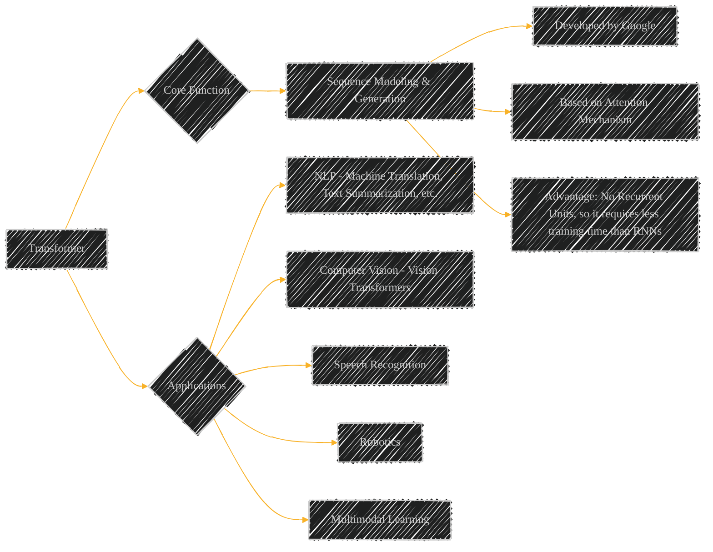

**Description:** Establishes the Transformer as a key architecture for sequential data. It highlights applications besides NLP such as CV, speech and robotics.

----

## 2. Historical Context: From RNNs to Transformers

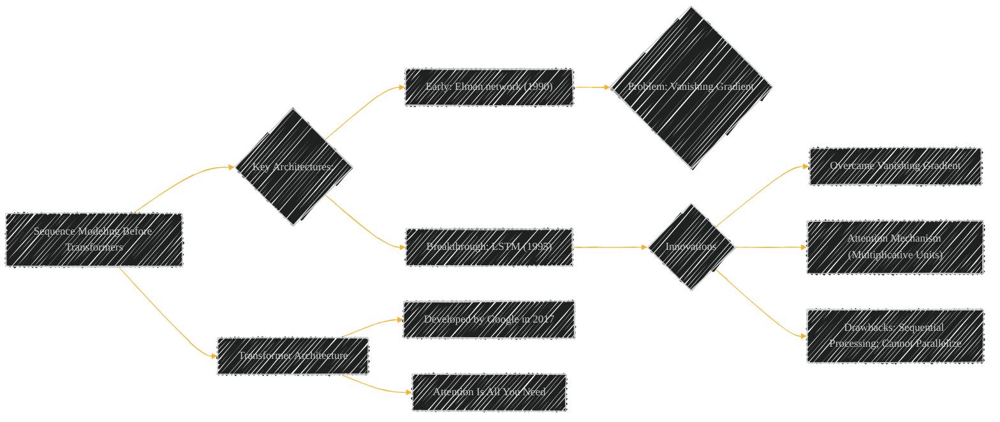

**Description:** Places the Transformer in the historical progression of sequence modeling. Introduces the need for better architectural performance than LSTMs.

----

## 3. Transformer's Core Principle: The Attention Mechanism

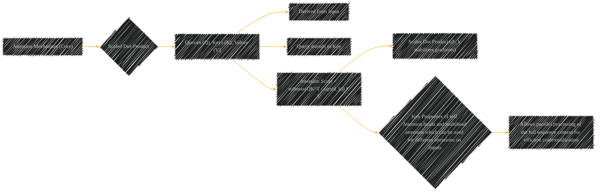

**Description:** Isolates the core computational unit, "scaled dot-product".  It breaks down the input vector and its role within the Transformer. Important in relation to multi head attention.

----

## 4. Encoder-Decoder Architecture: The Transformer's Blueprint

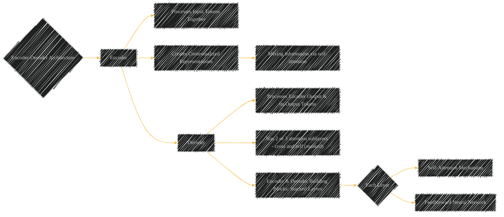

**Description:** Explains the architecture used in the original transformer. Shows the role of each sublayer, the use of self, cross - attentions and FFN.

----

## 5. Deep Dive: The Encoder Layer

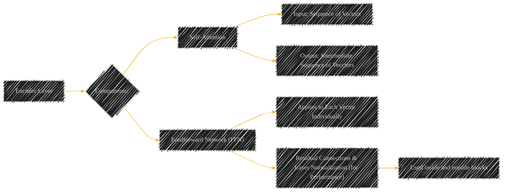

**Description:** Breaks down what the encoder constitutes of.

----

## 6. Deciphering Sublayers: Encoder (simplified)

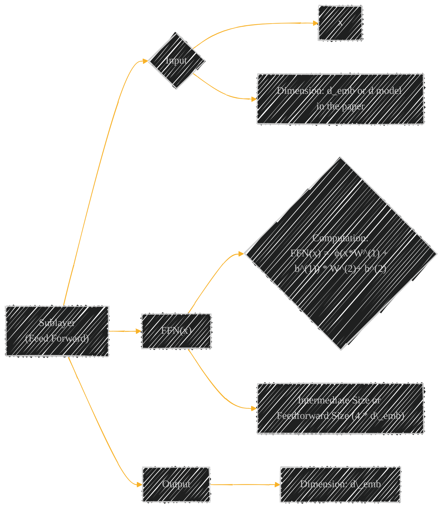

----

## 7. Feedforward Network (FFN)

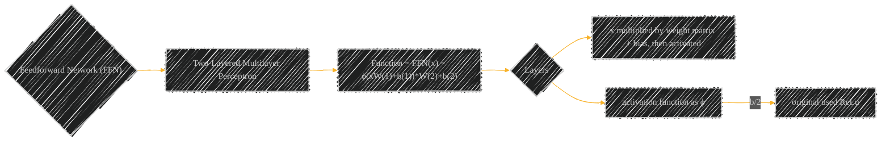

**Description:** Focuses the calculation made, size, and activation calculations on the Feedward Network.

----

## 8. Self-Attention Expanded: Attention with scaled dot-product

**Description:** Isolate the computational unit, "scaled dot-product attention" It highlights inputs, calculations for finding weight, and calculating the scaled result.

----

## 9. Encoder Calculations

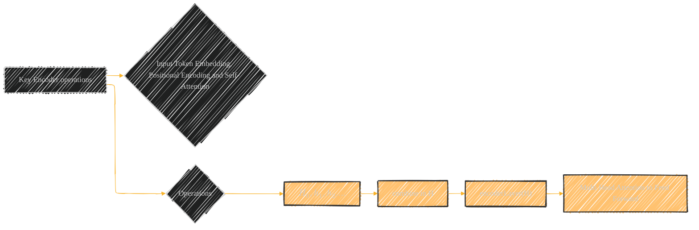

----

## 10. Decoder Expanded: Decoding steps

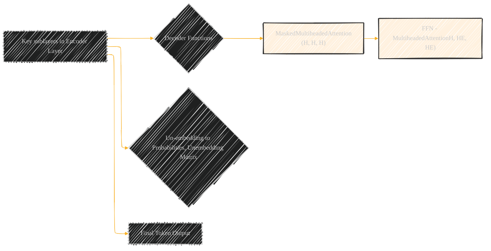

## 11. Deep Dive: Transformer's Full Architecture

**Description:** Presents one encoder and decoder (original case) architecture and the functionality including residual connection  and layer normalization steps within each block and connections together. This shows input, output, and the flow as vector data from layer embedding.

----

## 12. Variants and Enhancements

**Description:** Presents several variations possible in Transformers architectures: (Encoder, Decoder, etc..) and different approach to solve the difficulty/pain points in various scenarios. This highlights different function modifications.

----

## 13 Tokenizing

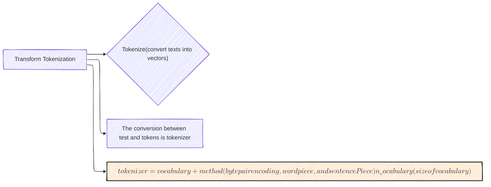

----

## 13. Attention Variations for Efficient Implementation

**Description:** Focuses for efficient implementation using the transformer model (fast attention calculation ,etc.);

----

## 14. Sub-Quadratic Transformer Approached for Long Inputs

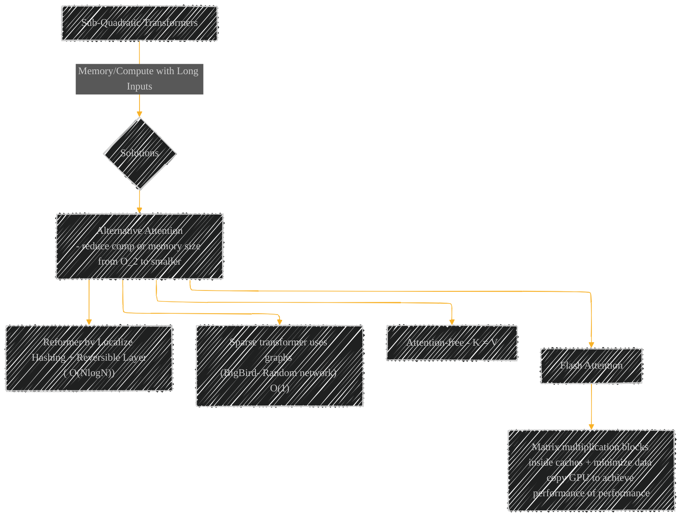

----

## Method / Algorithm Analysis

These diagrams and illustrations are designed to provide a complete understanding of the Transformer architecture. They are also consistent in formatting and labeling, which could prove extremely useful as direct setting elements in any AI agent.

---
**Licenses:**

- **MIT License:**   - Full text in [LICENSE](LICENSE) file.
- **Creative Commons Attribution 4.0 International:**  - Legal details in [LICENSE-CC-BY](LICENSE-CC-BY) and at [Creative Commons official site](http://creativecommons.org/licenses/by/4.0/).

---