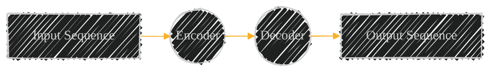
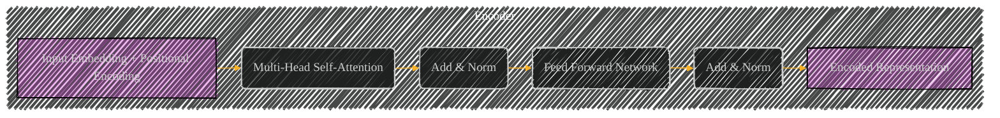
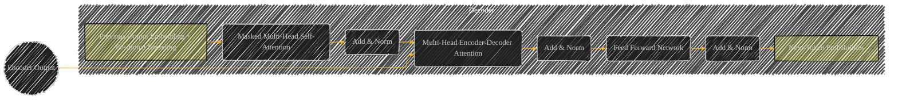

# CHANGE_ME
> This content is dual-licensed under your choice of the following licenses:
> 1.  **MIT License:** For the code implementations in Swift and Mermaid provided in this document.
> 2.  **Creative Commons Attribution 4.0 International License (CC BY 4.0):** For all other content, including the text, explanations, and the Mermaid diagrams and illustrations.

---

Below is my personal notes on the topics and I might gather information from various sources, which I wil cite accordingly.

## The Transformer Architecture: A Deep Dive

The Transformer is a deep learning architecture that revolutionized sequence-to-sequence tasks, largely eliminating the need for recurrence or convolutions. It leverages the **attention mechanism** to achieve parallelization and capture complex relationships between elements in input and output sequences.

### 1. Core Concepts and Overall Structure

The Transformer follows an encoder-decoder structure:

*   **Encoder:** Processes the input sequence and generates a contextualized, encoded representation.
*   **Decoder:** Generates the output sequence, conditioned on the encoded representation from the encoder.

Both the encoder and decoder are composed of *stacks* of identical layers.  Each layer has two primary sub-layers:

1.  **Multi-Head Attention:**  Allows the model to attend to different parts of the sequence and learn relationships between them.
2.  **Feed-Forward Network:**  Applies a position-wise, fully connected feed-forward network to further process the attention output.

### 2. Input Processing

Before entering the encoder, the input sequence undergoes two key transformations:

*   **Input Embedding:** Each word/token in the input sequence is converted into a fixed-size vector (embedding) that represents its semantic meaning:

    $$
    \text{Embedding}(x) = \mathbf{e} \in \mathbb{R}^{d_{\text{model}}}
    $$

    where $x$ is an input token, and $\mathbf{e}$ is its embedding vector, typically in a 512-dimensional space ($d_{\text{model}} = 512$ in the original paper).

*   **Positional Encoding:**  Since the Transformer lacks inherent sequential processing, information about the *position* of each token is *added* to its embedding:

    $$
    \begin{aligned}
    PE(pos, 2i) &= \sin(pos / 10000^{2i/d_{\text{model}}}) \\
    PE(pos, 2i+1) &= \cos(pos / 10000^{2i/d_{\text{model}}})
    \end{aligned}
    $$

    Where *pos* is the position, *i* is the dimension, and $d_{\text{model}}$ model is the model's internal dimension.

The input to the encoder is created by summing:

$$
\mathbf{x}_{\text{input}} = \text{Embedding}(x) + \text{PositionalEncoding}(pos)
$$

### 3. Encoder

Each encoder layer comprises the following:

*   **Multi-Head Self-Attention:** This mechanism allows the encoder to attend to all positions in the input sequence *simultaneously*.   Crucially, the input is transformed into three matrices:

    *   Queries ($Q$)
    *   Keys ($K$)
    *   Values ($V$)

    For a *single* attention head, **Scaled Dot-Product Attention** is calculated as:

    $$
    \text{Attention}(Q, K, V) = \text{softmax}\left(\frac{QK^T}{\sqrt{d_k}}\right)V
    $$

    where $d_k$ is the dimension of the keys (and queries). The division by $\sqrt{d_k}$ is for scaling, preventing large dot products from making the softmax function saturate.

    Multi-Head Attention performs this operation *h* times in parallel, with different, learned linear projections of  Q, K, and V:

    $$
    \begin{aligned}
    \text{MultiHead}(Q, K, V) &= \text{Concat}(\text{head}_1, ..., \text{head}_h)W^O \\
    \text{where head}_i &= \text{Attention}(QW^Q_i, KW^K_i, VW^V_i)
    \end{aligned}
    $$

     Here, $W^Q_i \in \mathbb{R}^{d_{\text{model}} \times d_k}$,  $W^K_i \in \mathbb{R}^{d_{\text{model}} \times d_k}$, $W^V_i \in \mathbb{R}^{d_{\text{model}} \times d_v}$, and $W^O \in \mathbb{R}^{hd_v \times d_{\text{model}}}$ are learned projection matrices.

*   **Add & Norm:**  A *residual connection* is added around the Multi-Head Attention sub-layer, followed by *Layer Normalization*:

    $$
    \text{LayerNorm}(x + \text{MultiHead}(x))
    $$

    The `x` represents the input of Self-Attention, with projections on it generating `Q`, `K` and `V`.

*   **Feed Forward Network (FFN):**  A position-wise (applied to each token independently), fully connected feed-forward network is added next. This usually consists of two linear transformations with a ReLU activation in between:

    $$
    \text{FFN}(x) = \max(0, xW_1 + b_1)W_2 + b_2
    $$

   where $W_1$, $b_1$, $W_2$, $b_2$ are learnable weights and biases, and $x$ is the output of the Add & layer normalization component ($x = \text{LayerNorm}(x + \text{MultiHead}(x))$).

*   **Add & Norm (again):**  Another residual connection and Layer Normalization are applied around the FFN:

    $$
     \text{LayerNorm}(x +  \text{FFN}(x))
    $$

    The final encoded representation is the sequence of vectors output by this last Add & Norm layer of the *final* layer in the encoder stack.

### 4. Decoder

The decoder is similar to the encoder, but with key differences:

*   **Masked Multi-Head Self-Attention:**  Similar to the encoder's self-attention, but a *mask* is applied to prevent the decoder from attending to "future" tokens in the output sequence.  This ensures that predictions for position *i* can only depend on known outputs at positions less than *i*. It masks (setting to $-\infty$ before softmax) all entries above  diagnal of of the $QK^\top$ matrix in:$$ \text{softmax}\left(\frac{QK^T}{\sqrt{d_k}}\right)V$$
and then normalizes the probability contributions to ensure the proper probability distribution.

*   **Multi-Head Encoder-Decoder Attention:**  This layer attends to the *output* of the encoder stack. This allows the decoder to incorporate the information from the encoded input.  In this case, the Queries ($Q$) Come form the _Masked- Multihead Self-Attention_, whereas the Keys ($K$) and Values ($V$) comes from the output of the encoder (`x`).

*   **Add & Norm:** Residual connections and Layer Normalization are applied around both of the self-attention layer and the FFN.

*   **Linear Layer and Softmax:**  After the final decoder layer, a linear layer maps the decoder output to the vocabulary, followed by a softmax function turning them into probabilities for next-token prediction:

$$
P(\text{next token}| \text{previous tokens, encoded input}) = \text{softmax}(xW_{\text{final}} + b_{\text{final}})
$$

Where $x$ representing $x = \text{LayerNorm}(x + \text{MultiHead}(x))$ from Encoder-Decoder attnetion output.
### Time and Space Complexity

Given `n` is the sequence length, `d` is the embedding dimension and `l` is the number layers.

| Module               | Time Complexity  | Space Complexity     |
| -------------------- | ---------------- | -------------------- |
| Embedding            | $O(n * d^2)$     | $O(vocab\_size * d)$ |
| Multi-Head Attn      | $O(n^2 * d * l)$ | $O(n * d + l * d^2)$ |
| Feed-Forward Net     | $O(n * d^2 * l)$ | $O( l* n * d^2)$     |
| Residual, LayerNorm  | $O(n * d * l)$   | $O(n  * d * l )$     |
| Output &  Prediction | O(n* d)          | O(vocab_size * d)    |

### Key Advancements and Considerations

*   **Parallelization:** Unlike RNNs, the Transformer processes elements concurrently.
*   **Long-Range Dependencies:** The attention mechanism enables efficient modeling of relationships between distant parts of the sequence.
*   **Computational Cost:**  While parallel, the self-attention mechanism has quadratic complexity $O(n^2 * d * l)$  with respect to sequence length.  This has led to substantial research in efficient alternatives (e.g., linear attention, sparse attention).
* **Pre-training and Transfer Learning**: Transformers form the backbone of many recent, highly successful models like BERT and GPT, demonstrating their suitability for large-scale pre-training and then fine-tuning to more specify tasks.

---
**Licenses:**

- **MIT License:**   - Full text in [LICENSE](LICENSE) file.
- **Creative Commons Attribution 4.0 International:**  - Legal details in [LICENSE-CC-BY](LICENSE-CC-BY) and at [Creative Commons official site](http://creativecommons.org/licenses/by/4.0/).

---