# YOLOv12: Attention-Centric Real-Time Object Detectors
> **Disclaimer:**
>
> This document contains my personal notes on the topic,
> compiled from publicly available documentation and various cited sources.
> The materials are intended for educational purposes, personal study, and reference.
> The content is dual-licensed:
> 1. **MIT License:** Applies to all code implementations (Swift, Mermaid, and other programming languages).
> 2. **Creative Commons Attribution 4.0 International License (CC BY 4.0):** Applies to all non-code content, including text, explanations, diagrams, and illustrations.
---


## YOLOv12 Paper Overview - A Diagrammatic Guide 


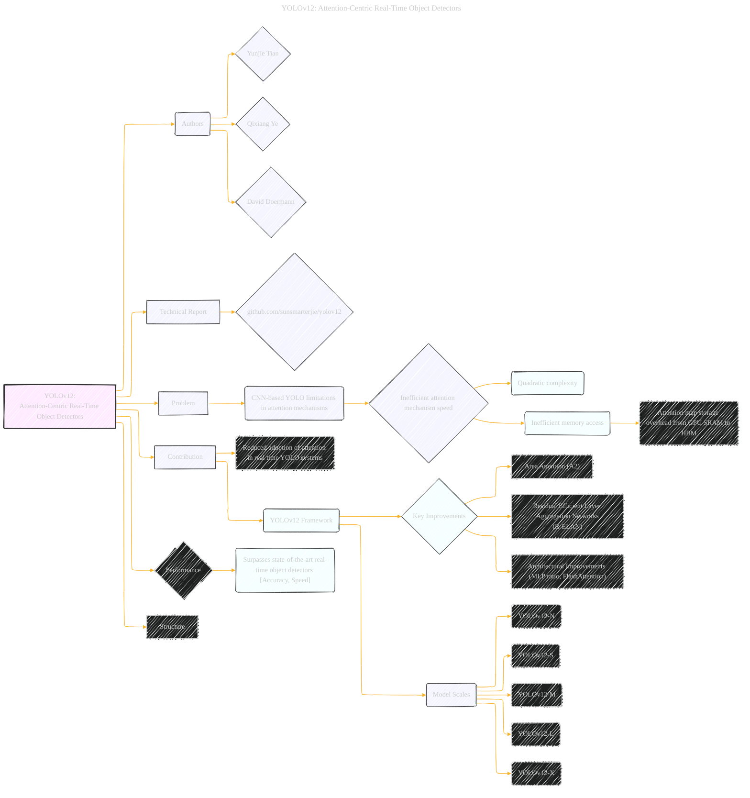

---


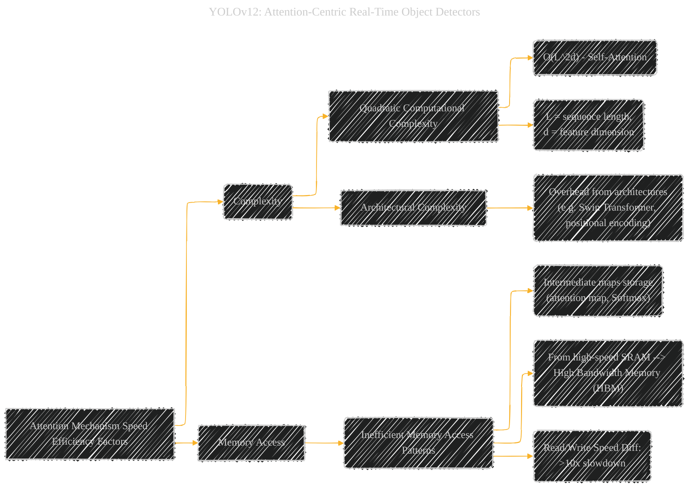


---


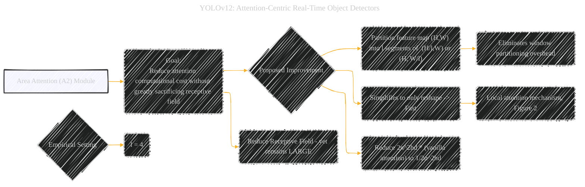


---


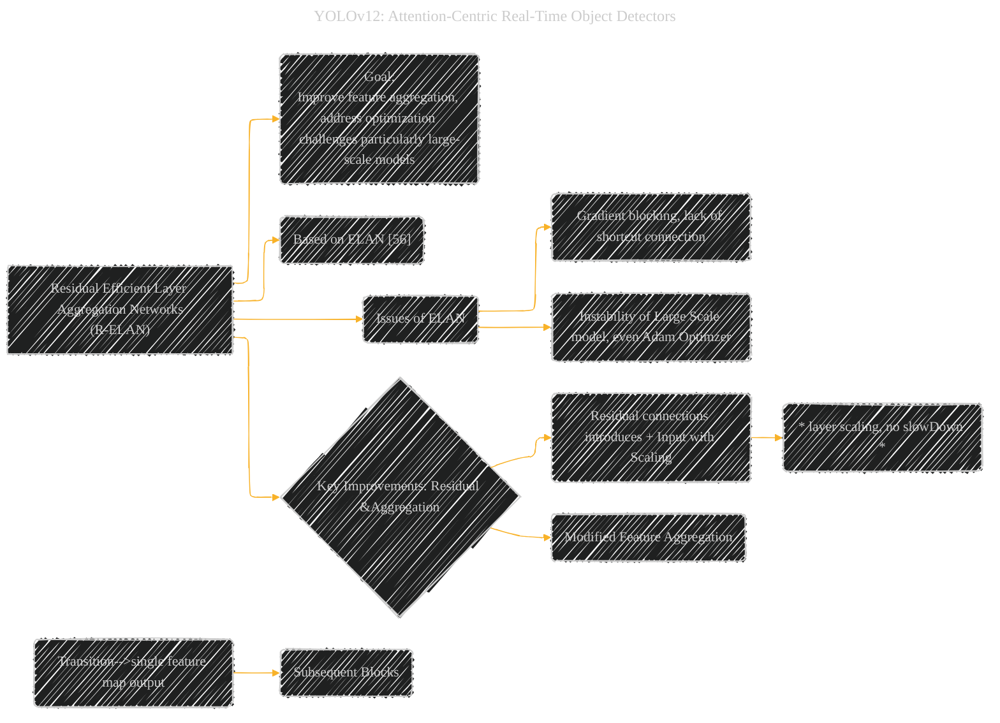


---


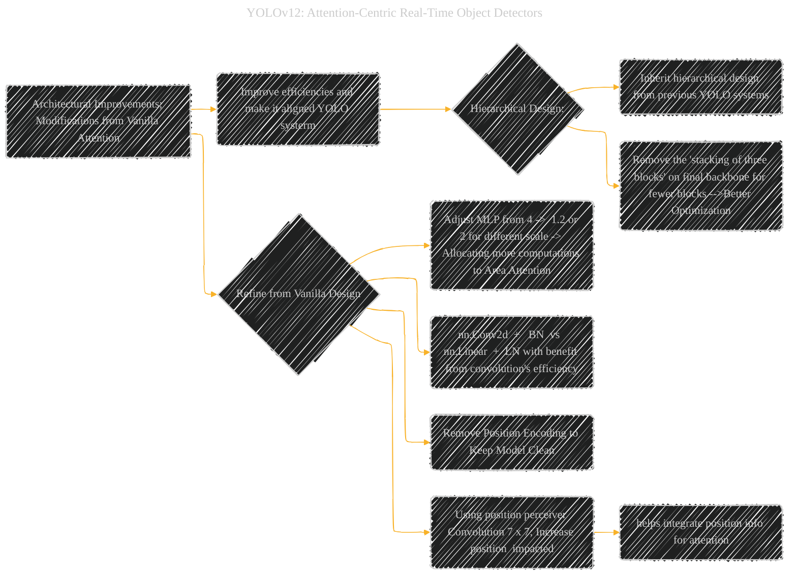

---


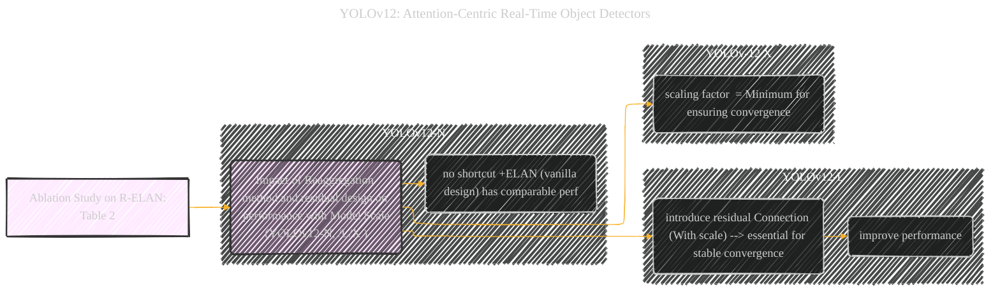


---


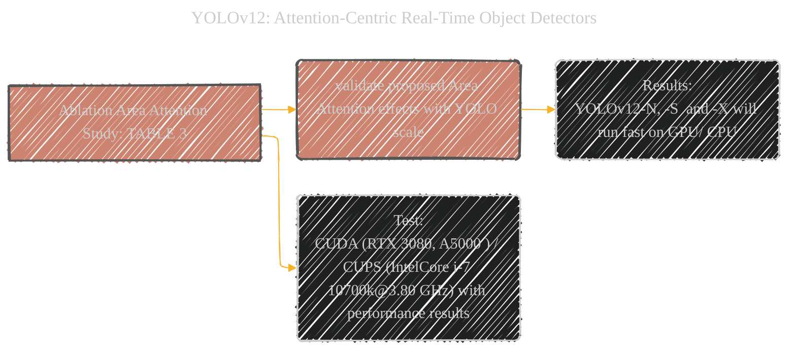


---


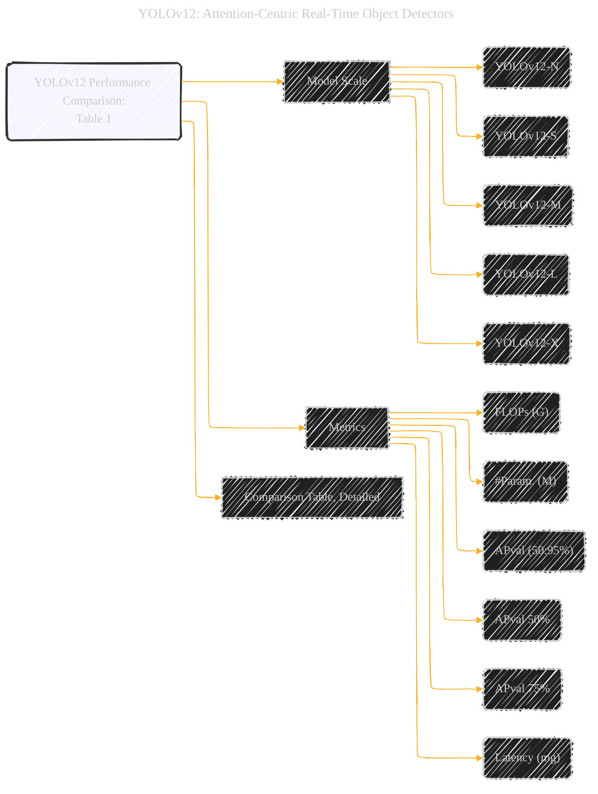

---


----


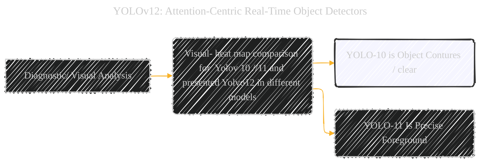


----


---


```mermaid
gantt
    title Timeline of the YOLOv12 Research
    dateFormat  YYYY-MM-DD
    axisFormat  %Y-%m-%d
    section Conceptualization and Planning
    Define Problem         :done,    a1, 2024-04-15, 3d
    Literature Review       :active,   a2, 2024-04-18, 5d
    Formulate Hypotheses  :      a3, 2024-04-23, 2d
    section Design & Implementation
    Develop Area Attention  :         b1, after a3, 7d
 Test and Refine     :   b2, after b1, 6d
    Implement R-ELAN  :        b3,   after  b2, 8d
    Integrate Architectural Improvements  :    after b3, 7d
    section Experimentation & Evaluation
    Train and Evaluate Models         :   c1, after b3, 15d
   Ablation studies  :        c2,after c1, 8d
  Performance Analysis and Benchmarking    :  c3,after c2, 10d
  section Analysis & Writing
    Analyze Results & Visualization        : d1,after c3,7d
  Write Draft   :  d2,  after d1, 10d
  refine Paper: d3, after d1 and d2
```

---

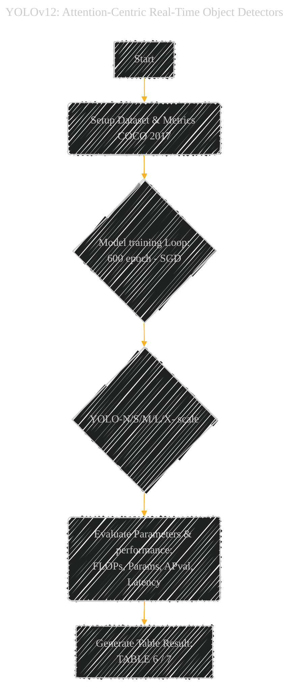


----


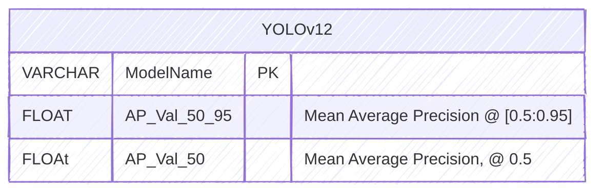


---
**Licenses:**

- **MIT License:**  [](LICENSE) - Full text in [LICENSE](LICENSE) file.
- **Creative Commons Attribution 4.0 International:** [](LICENSE-CC-BY) - Legal details in [LICENSE-CC-BY](LICENSE-CC-BY) and at [Creative Commons official site](http://creativecommons.org/licenses/by/4.0/).

---