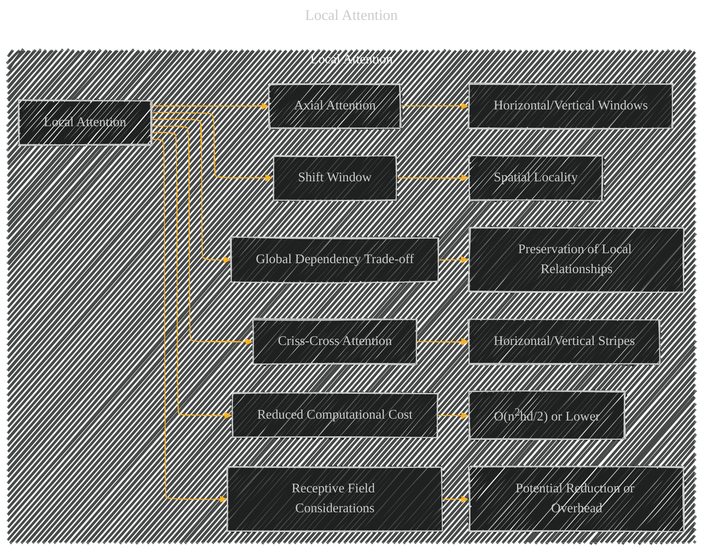

# Local Attention
> **Disclaimer:**
>
> This document contains my personal notes on the topic,
> compiled from publicly available documentation and various cited sources.
> The materials are intended for educational purposes, personal study, and reference.
> The content is dual-licensed:
> 1. **MIT License:** Applies to all code implementations (Swift, Mermaid, and other programming languages).
> 2. **Creative Commons Attribution 4.0 International License (CC BY 4.0):** Applies to all non-code content, including text, explanations, diagrams, and illustrations.
---

## Local Attention - A Diagrammatic Guide 

---

### Explanation

* **Local Attention (A):** This is the main concept, a node representing the overarching idea.

* **Specific Local Attention Methods (B, C, D):** These branches represent the different types of local attention mechanisms mentioned (Shift Window, Criss-Cross, Axial).

* **Characteristics (E, F, G):** These branches detail the characteristics of each local attention method.  For instance, Shift Window might focus on spatial locality within a grid.

* **Computational Efficiency (H, I):** This illustrates the key benefit of local attention: reduced computational complexity compared to global attention.  An equation like `O(n2hd/2)` (or similar) would be a very helpful addition to node `I`.

* **Receptive Field Considerations (J, K):**  This addresses a potential trade-off.  Local attention might reduce the receptive field, potentially impacting accuracy.

* **Global Dependency Trade-off (L, M):** This emphasizes the trade-off between capturing long-range dependencies and the efficiency gains of locality.  The result of the trade-off is preservation of local relationships (M).

This structure more accurately reflects the concepts associated with local attention, including the trade-offs and characteristics that distinguish it from global attention.  Adding specific details like the complexity equations or how window partitioning works would enhance the diagram.

---
**Licenses:**

- **MIT License:**   - Full text in [LICENSE](LICENSE) file.
- **Creative Commons Attribution 4.0 International:**  - Legal details in [LICENSE-CC-BY](LICENSE-CC-BY) and at [Creative Commons official site](http://creativecommons.org/licenses/by/4.0/).

---