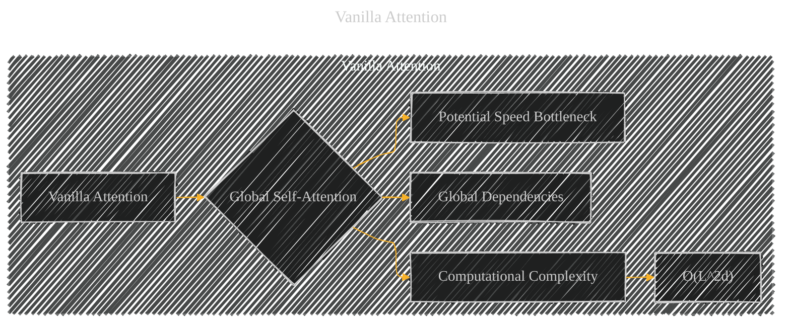

# Vanilla Attention
> **Disclaimer:**
>
> This document contains my personal notes on the topic,
> compiled from publicly available documentation and various cited sources.
> The materials are intended for educational purposes, personal study, and reference.
> The content is dual-licensed:
> 1. **MIT License:** Applies to all code implementations (Swift, Mermaid, and other programming languages).
> 2. **Creative Commons Attribution 4.0 International License (CC BY 4.0):** Applies to all non-code content, including text, explanations, diagrams, and illustrations.
---

## Vanilla Attention - A Diagrammatic Guide 

This diagram shows a simple representation of Vanilla Attention.  It highlights the key characteristics:

* **Global Self-Attention (B):**  The core idea is that each element in the input attends to every other element.
* **Computational Complexity (C):**  The quadratic time complexity (O(L2d)) is shown as a direct consequence of the global nature.
* **Global Dependencies (E):**  This represents the feature that vanilla attention captures relationships between all parts of the input.
* **Potential Speed Bottleneck (F):**  Indicates the inherent slowness of this type of attention compared to other methods.

This basic structure can be further expanded to include details specific to the use case in the larger context of the paper, such as the particular shape of the input (images, sequences), and relevant connections to other parts of the YOLOv12 framework.

---
**Licenses:**

- **MIT License:**   - Full text in [LICENSE](LICENSE) file.
- **Creative Commons Attribution 4.0 International:**  - Legal details in [LICENSE-CC-BY](LICENSE-CC-BY) and at [Creative Commons official site](http://creativecommons.org/licenses/by/4.0/).

---