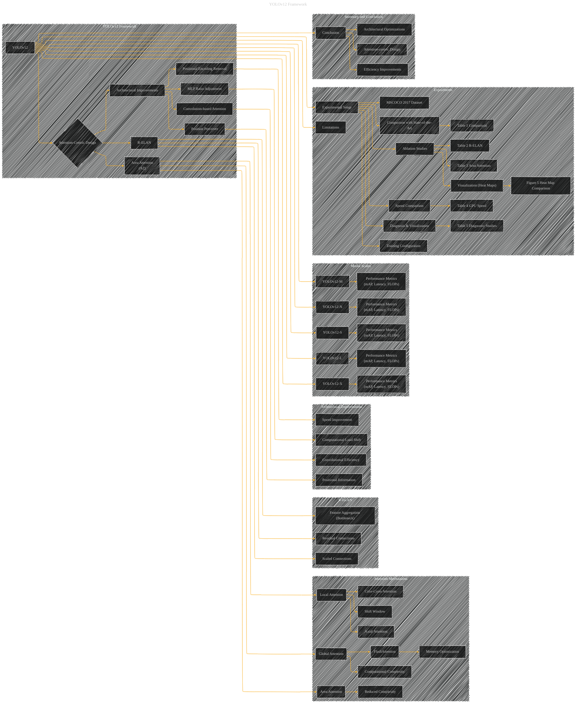

# YOLOv12: Attention-Centric Real-Time Object Detectors
> **Disclaimer:**
>
> This document contains my personal notes on the topic,
> compiled from publicly available documentation and various cited sources.
> The materials are intended for educational purposes, personal study, and reference.
> The content is dual-licensed:
> 1. **MIT License:** Applies to all code implementations (Swift, Mermaid, and other programming languages).
> 2. **Creative Commons Attribution 4.0 International License (CC BY 4.0):** Applies to all non-code content, including text, explanations, diagrams, and illustrations.
---

## YOLOv12 Framework

The YOLOv12 paper focuses on improving real-time object detection by incorporating attention mechanisms, addressing limitations in computational efficiency and memory access associated with global self-attention.  Here's a breakdown of the key concepts, using the suggested diagram structure:

**Key Concepts and Corresponding Diagram Elements:**

* **YOLOv12 Framework (Overall):** This is the central concept. It can be represented as a main node with sub-diagrams showing the specific components and improvements over previous YOLO versions.

* **Attention Mechanisms (Directed Acyclic Graphs):** The paper explores different attention mechanisms.
    * **Vanilla Attention:**  A node representing global self-attention.  This node would be linked to nodes representing its computational complexity (O(L2d)).
    * **Area Attention (A2):** A node representing the proposed local attention mechanism, with connections to nodes showcasing its reduced complexity (O(n2hd/2)).
    * **Local Attention Mechanisms:** Nodes like Shift Window, Criss-Cross, and Axial Attention would be included in the attention mechanism subgraph and linked to the vanilla attention node.
    * **FlashAttention:** A node highlighting the speedup achieved by memory optimization.  Connections could indicate the relationship with hardware capabilities (Turing, Ampere, Ada Lovelace).

* **Residual Efficient Layer Aggregation Networks (R-ELAN):** A node representing this improvement over ELAN.  Subgraph nodes would showcase the residual connections (for stability in larger models), scaled connections, and the new feature aggregation method (bottleneck structure).  Edges would indicate the impact on convergence and model complexity.

* **Architectural Improvements (General):**  Nodes representing specific architectural adjustments:  
    * **MLP Ratio:** A node showing the change from 4 to 1.2 (or 2 for smaller models).  Connections could indicate the trade-offs in computation.
    * **Convolution-based Attention:** A node illustrating the use of `nn.Conv2d+BN` instead of `nn.Linear+LN`.  Connections would highlight the computational efficiency gain.
    * **Removal of Positional Encoding:** A node indicating this simplification, showing its effect on speed.
    * **Position Perceiver:** A node showing the use of large separable convolutions, with connections illustrating the impact on speed and perception.

* **Model Scales (YOLOv12-N, S, M, L, X):** Nodes representing each scale, with connections indicating the trade-offs in FLOPs, parameters, latency, and mAP.

* **Experimental Setup:** This would be represented by a node linked to the YOLOv12 framework, showing the dataset used (MSCOCO 2017) and training configuration (epochs, optimizer, learning rate).

* **Comparison with State-of-the-Art:** Tables comparing YOLOv12 to other real-time detectors (e.g., YOLOv10, YOLOv11, RT-DETR).  This would involve nodes representing each method, with edges reflecting their performance metrics (mAP, latency, FLOPs).

* **Ablation Studies:**  A node representing the analysis of individual improvements (R-ELAN, Area Attention, etc.).  Edges would connect to nodes illustrating the results of these studies in tables.

* **Visualization (Heat Maps):** Include a node representing the visualization of activations (heatmaps) and their impact on object perception.

* **Limitations:** A node representing the limitations of the method (FlashAttention requirement for specific hardware).

----

### YOLOv12 Framework - A Diagrammatic Guide

---

### Explanation and Improvement

* **Subgraphs:** The diagrams are now organized into logical subgraphs, improving readability and clarity.  Each subgraph corresponds to a key area of the paper (Attention Mechanisms, R-ELAN, etc.).

* **Relationships:**  Directed edges clearly show the relationships between concepts.  For example, `B --> C` indicates that the YOLOv12 framework uses Area Attention.

* **Specificity:**  Nodes are now more specific (e.g., "Reduced Complexity (O(n^2hd/2))" instead of just "Complexity"). This helps to convey the core details of each improvement.

* **Experiment Integration:**  The `Experiments` subgraph integrates the tables (Table 1, Table 2, Table 3, Table 4, Table 5, Figure 5) into the overall structure, linking them to the corresponding concepts and making the diagram a more complete representation of the YOLOv12 paper.

* **Summary and Conclusion:** A `Summary and Conclusion` subgraph provides a high-level overview of the paper's core contributions.

* **Hardware:**  Nodes related to hardware are more explicitly linked to the corresponding concept (e.g., `R --> S[Memory Optimization]`).

---

### Further Improvements

* **Data Flow:**  For a more sophisticated visualization, add nodes and edges representing the flow of data through the network architecture (inputs, features, intermediate results, outputs). This would enhance the understanding of how the different components interact.
* **Quantitative Details:**  Add inline math or numerical values (like the complexity equations) directly to the relevant nodes to make the diagram more informative.

---
**Licenses:**

- **MIT License:**   - Full text in [LICENSE](LICENSE) file.
- **Creative Commons Attribution 4.0 International:**  - Legal details in [LICENSE-CC-BY](LICENSE-CC-BY) and at [Creative Commons official site](http://creativecommons.org/licenses/by/4.0/).

---